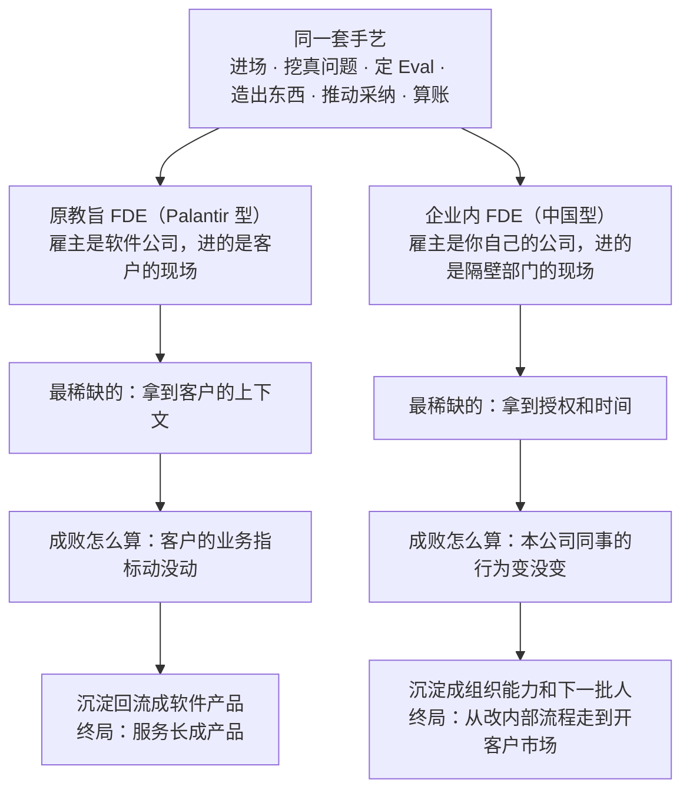

# 第 1 章 都买了 AI 的公司，为什么还是没变

## 一、输给一个微信群的 AI 助手

恒岳重工是一家做工程机械的公司，总部在长沙，全国有两千三百名售后服务工程师。前年，他们给这支队伍上了一套 AI 维修助手。

这件事从立项到验收都很体面。语料是公司二十年攒下来的家底：整机和主要部件的维修手册、四十多万条历史工单、培训中心的全套课件、历年发出的故障通报。检索和问答的链路是外面一家技术公司搭的，做得也不含糊，验收会上跑了一套两百道题的测试集，准确率 85% 以上，现场随机抽问了十几个故障，答案挑不出毛病。App 做了 iOS 和安卓两个版本，全国两千三百多名服务工程师的账号在两周之内全部开通。分管副总在总结里写的是"售后知识体系完成数字化"。

四个月后，这套系统的周活跃用户是 37 人。

两千三百个账号，每周真正打开过一次的是 37 个，这 37 个里面有 9 个是项目组自己的人。

有意思的地方在于，这四个月里，公司的售后知识体系其实一直在高强度运转，只是不在任何一份汇报材料里。它是一个微信群，群名叫"服务技术交流"，四百三十多人，群主是华东区一位干了十九年的老师傅。这个群每天几百条消息，从早上七点响到晚上十一点。有人在群里发一张漏油的照片，配四个字"这啥毛病"，三十秒之内一般就有人回："先导阀那儿吧，滤芯拆下来看看。"

公司花钱买的系统没人用，公司没花钱的那个群一天几百条。这两件事同时成立了四个月，没有人觉得需要解释一下。

项目组内部吵过一轮。技术那边认为是模型不够强，主张换更大的模型、继续调检索精度、把测试集准确率从 85% 拉到 92%。业务那边认为是推广不到位，主张让总部发文，把 App 的使用次数写进服务网点的月度考核。两边都有道理，两边都拿不出证据。而管理层的耐心是以周计的，再过一个季度没有起色，这个项目就会安静地进入"已上线、已归档"的名单，成为公司内部再也没人提起的一次 AI 尝试。

后来接手这件事的人做了一个在当时看起来非常不划算的决定。他没有改系统，他去跟车。

十天时间，跟着三个大区的六位服务工程师出车。早上七点在网点集合，钻进那辆后厢里塞满扳手、桶装水和备件纸箱的面包车，一天跑两到四个工地。这十天里，项目在管理层眼里的状态是"毫无进展"。

十天之后他回到公司，手里没有一行新代码，也没有一张新的架构图。他带回来的是几件在会议室里永远说不出口的事，而且没有一件和"AI 准不准"有关系。那十天他到底看见了什么，第 6 章会整章讲；他回来之后动的手，在第 9 章。这一章要说的是它前面那个问题：为什么一家把钱、语料、账号和考核都给足了的公司，最后输给了一个没人管理的微信群。

（恒岳重工这个故事根据真实案例脱敏改编，公司、人物、数据均为示例，仅用于说明流程。因为不便披露客户情况，这里按真实情况改写成一个更清晰的版本，方便理解。）

## 二、中间缺的那一层

那十天里发生的事，本质上不是技术活。

不是员工懒。两千多个服务工程师每天在工地上跟设备较劲，他们不用这个系统，是因为这个系统在工地上帮不上忙。也不是工具差。同一个模型、同一批底层语料，后来在同一批人手里被用了起来，说明工具从来不是瓶颈。

中间缺的是**进到业务里去、把流程和产品一起改掉的那个人**。这句话是这本书的地基。

这个人得同时具备三样东西。他要能在工地上跟车跟够十天，看见工程师手套上的那层机油；他要能自己动手把语料结构和回答顺序改掉，而不是提一个需求单等三个月排期；他还得有权把"把 AI 放进微信群"这种事定下来，而不用先去说服 IT、信息安全、售后和市场四个部门。

在中国企业里，这三样东西通常分给三个不同的人，坐在三个不同的部门，向三个不同的领导汇报。跟车的人没有改代码的权限，改代码的人没有进工地的时间，有权拍板的人两样都不干。于是就有了那种熟悉的场面：AI 助手全员开通了，动员会开过了，六个月后打开率报表还挂在那里，业务数字一个都没动。

我做企业 AI 顾问这几年，看到的卡点几乎全长一个样。老板以为自己缺的是模型，IT 以为自己缺的是预算，业务以为自己缺的是时间。真正缺的是那一层人，而那一层人在大多数公司的组织架构图上根本不存在。

## 三、三组数字

判断得有数字垫底，我垫三组。

第一组是坏消息。MIT 的 NANDA 项目研究了 300 个公开的企业 AI 项目，结论是 **95% 的企业生成式 AI 项目对损益表没有可衡量的影响**。绝大多数公司花了钱，账上看不出来。

第二组是好消息，也是这个岗位正在被市场定价的证据。FDE 相关岗位的数量一年之内涨了约 7 倍，从 2025 年 4 月的约 643 个到 2026 年 4 月的约 5330 个，同期 AI 工程师岗位的涨幅大概是它的三分之一。美国市场上资深 FDE 的年薪中位数约 48.5 万美元。

第三组是产业级的动作。OpenAI 在 2024 年组建了自己的 FDE 团队并且持续扩张，还专门成立了一家做部署的公司；Anthropic 在扩自己的 Applied AI 团队，名字不叫 FDE，干的是同一件事。这两家公司手里握着全世界最强的模型，本来最没有理由派人去客户现场蹲着。它们仍然派了，而且在加派。这说明它们已经承认了一件事：AI 普及的瓶颈在部署，不在模型能力。

三组数字放在一起说的是同一件事。需求侧的失败率已经被量化，供给侧的价格已经被抬起来，连模型的生产者本人都开始往客户现场派工程师。

但它们只回答了"这个岗位很重要"，一个都没有回答"中国企业该从哪里得到这批人"。

这本书要回答的是后一个问题。

## 四、两种 FDE，得先分开定义

FDE 的全称是 Forward Deployed Engineer，前线部署工程师。字面意思就是它的做法：把工程师派到客户的工厂、医院、机房里去，坐在业务旁边写代码。这个岗位不是 AI 时代的发明，二十多年前就出现在 Palantir 这家美国数据平台公司里，今天所有关于 FDE 的讨论，源头都能追到那里。

但在讲来历之前，必须先把定义拆开，因为这本书后面讲的 FDE，和 Palantir 的 FDE 不是同一个岗位。你如果带着 Palantir 那个岗位的印象往下读，会觉得这件事跟自己没关系——那是一家美国软件公司派人去客户现场，跟一家长沙的工程机械公司有什么关系。

原教旨的 Palantir FDE，本质上是一个产品策略岗位，而不只是一个进入市场的策略岗位。这句话的意思是，这个人的产出不止于把东西卖进去、交付掉。Palantir 今天一半以上的收入来自前线抽象出来的通用组件，而这些组件都是先在某一个客户的现场被造出来、再被抽象成产品的。决定这家公司下一个产品长什么样的，是前线那批人在客户那里看见的东西。这不是销售策略，是产品策略。

中国企业内部的 FDE 是另一种角色。他的任务是：让企业里面已经 AI ready 的这批人，去提高整个公司组织的 AI 水平，带着整个组织完成 AI 转型。这更符合中国的实际情况。

两者从哪里分的岔，摆在一起就清楚了。



*图注：岔口在顶上那一格的下一行——雇主是谁。同一套动作，往左做一遍是在给别人的公司创造资产，往右做一遍是在给自己的公司创造资产，而这一个字的差别，会一路决定后面每一格该怎么填。*

**这本书教的是右边这一支，手艺借的是左边那一支**。所以下一节不是一段美国公司史，是这套手艺的来源，只讲三样，讲完就回中国；至于中国为什么走不通左边那一支，是第六节的全部内容。

## 五、手艺是从哪儿来的

把工程师派到客户现场这件事，Palantir 干了二十多年。这家公司给情报机构、军方和大型企业做数据平台，FDE 这个岗位就是他们发明的。关于这家公司内部怎么运转，最完整的一份一手记述来自 Nabeel Qureshi，他 2015 年入职伦敦办公室，做了近八年 FDE，2024 年离职之后写了一篇长复盘。下面三样东西出自他和 Palantir 的公开材料，也正是这本书后面九站要借的三样。

**第一样，题目的写法**

Nabeel 的第一个大项目是空客。题目是空客最高层亲自定的：把 A350 的月产量从 4 架爬到 8 架，再往 16 架走。

请注意这个措辞。空客没有说"帮我们升级数据基础设施"，也没有说"建一个数据中台"。CEO 关心的只有一件事，每个月能下线几架飞机。Palantir 接下这单的时候，把合同和自己的成败也钉在了这个数字上。

一个题目写成"月产 4 架爬到 8 架"，和写成"数据治理"，招来的是两种人，走的是两条路。前者你每个月都知道自己有没有赢；后者你永远可以说还在推进中，而且谁也不能说你错。第 5 章讲第一仗怎么选题，用的就是这把尺子。空客那个项目具体是怎么打的、团队在前几周顶着"拿不出东西演示"的压力做了什么选择，第 8 章会展开。

**第二样，一条检验公式**

Palantir 官方博客里有一句话，值得背下来：留在总部造平台的工程师做的是"一个能力，很多客户"，派到前线的工程师做的是"一个客户，很多能力"。

同一个人在同一个客户身上，把数据集成、权限、可视化、运维一层层叠上去，这是 FDE 和普通实施工程师最本质的区别，也是判断一个岗位到底是不是 FDE 的最快检验。这本书后面每一站都在用它：你是在同一个部门身上把能力一层层叠上去，还是在把同一个能力铺给很多部门。前者是 FDE，后者是推广。

**第三样，这套机器的账**

前线反复遇到的同一类问题，会被总部抽象成通用组件；组件回流成产品，产品再卖给所有客户。到 2024 年，这些从前线长出来的组件驱动了 Palantir 一半以上的收入。

它的账面结果是：2023 年 Palantir 毛利率 80%，同期 Accenture 是 32%。2016 年说 Palantir 是一家咨询公司还算成立，今天不成立了，它完成了极少有公司做到的服务转产品。

这个 80% 是下一节的全部起点。

把三样收一收。美国的答案能跑通，靠的是三个前提同时成立。

第一，有一支肯常年出差、住到客户城市去的精英工程师队伍。

第二，有一个愿意为外部驻场付高价、而且愿意先付的甲方市场。

第三，有一个能把前线的定制回流成产品、从而让高毛利成立的后方。

三个前提里，中国企业能凑齐第三个的其实不少。最难的是第二个。

## 六、中国的岔路

### 20% 和 80% 的差别

中国的软件外包和咨询这个行业，一直没有真正长起来。

这不是印象，是账面上的事。国内头部的 IT 服务与软件外包上市公司，毛利率长期在 20% 到 30% 这个区间。作为对照，上一节那两个数字：Accenture 32%，Palantir 2023 年 80%。

毛利率这个数字看起来很财务，但它决定的是一件非常具体的事。

```
同样收 100 块，这 100 块怎么分，决定了你能雇什么人、能让他待多久

毛利 20%　国内头部的 IT 服务与软件外包
  人力 ████████████████████████████████ 80　│　毛利 ████████ 20
  雇什么人　　　单价可控、可替换、按人天计费
  能待多久　　　项目结束当天撤场，立刻转下一个项目
  这段时间记在　销售成本。人待得越久，这一单越亏

毛利 80%　Palantir，2023 年（同期 Accenture 32%）
  人力 ████████ 20　│　毛利 ████████████████████████████████ 80
  雇什么人　　　最好的工程师，一个客户长期专属
  能待多久　　　把人放进空客总装厂住一年半
  这段时间记在　研发投入。赌这一单里长出一个卖给所有客户的产品
```

*图注：那 20 块要覆盖销售、管理、坏账和利润，所以第一行那套账不是不愿意派最好的人长期驻场，是账上没有这一格。同一个动作在两套毛利结构里，一个记成亏损，一个记成投资。*

所以"中国也可以做 FDE 外部服务商"这句话，在账上是不成立的。在中国做外部 FDE，实际上就是在做外包，而中国的外包行业本身就没有富裕到能养一支精英驻场队伍。

甲方这边的不信任也有来历。企业过去买过的实施项目，大多数交付的是一套按需求文档做出来的系统，而需求文档本身是甲方业务口提的，业务提得对不对没有人保证。做完之后乙方撤场，系统留在那里，两年之后没人会改。这样的经验积累多了，甲方对"外面来的人能懂我的业务"这件事，天然是打折的。

乙方这边的难处更结构性。真正值钱的那段活——把老师傅脑子里的东西挖出来变成数据——成本几乎全部落在乙方，挖出来的资产归甲方，而且换一家客户基本上要重来一遍。做得越深，交付越重，人越多，毛利越薄。

### 我自己在这条路上撞的墙

这几年我给不少公司做顾问，做得最多的是讲大道理和带工作坊。

这个层面的生意其实很好做。集团层面要开战略会、要做年度规划，这种场合的预算反倒比较高，请得起我。我去讲一次两次，讲完大家很兴奋，付款也很爽快。听我讲课的十个项目，十个都会付钱，因为总共也就是一两次课的事。

真到要落地的时候，事情就变了。

我说落地我要带最好的团队进来，这批人的成本摆在那里。对面听完，几乎每一家都会绕到同一个问题上：能不能按业务效果付费。你先做，做出效果我再给钱，做不出效果我不给。

甲方的这个要求本身很正常。他们见过太多做完就走、留下一套没人会改的系统的乙方，所以要见了兔子再撒鹰。

但按效果付费这件事，我这边接不住。最好的人在项目最早期的投入是最重的，那段时间没有任何效果可言，成本却已经实打实地花出去了。而且我自己心里也清楚，我不能保证一定能出效果。我这边用最好的人，那我就得要更高的价钱；我要更高的价钱，甲方就更要把风险往后推。两边都在讲道理，于是大家一起卡在半路上。

数字是这样的。讲课的项目十个里十个都付款，因为便宜。但真要动手做，**十个到二十个里面才能转化成一个订单**，愿意付那个价格。付了那个价格的项目里，**三个里面才有一个是推进顺利的**，另外两个会卡在各种地方——数据拿不到、对接的人换了、老板的注意力转移了、业务口径吵不清楚。两个环节乘起来，成功率连三分之一都不到。

我还试过换一种收钱的方式。我试着在中国做 AI roll-up。这个词的意思是，不收服务费了，改成用资本合作的方式并购或者占股，把客户公司买下来一部分，我带人进去用 AI 把它的效率提上来，我赚的是这家公司变得更值钱之后我那部分股份的增值——那才是大钱。这条路在美国有人在跑。在中国我遇到了很多实际的困难。

所以我的结论是：**只要是第三方来做这件事，而且要做得深，整个激励结构在今天很难设计得当**。

这不是某一家乙方能力不行，也不是某一家甲方不开明。这是一个各方都在按自己的合理逻辑行事、最后一起停在半路上的结构。

### 一个注脚

2023 年到 2025 年，澜码科技是国内把这件事想得最清楚的公司之一。创始人周健是 ACM 世界冠军，有 Google 和阿里的技术背景，他给出的方法论是三步：专家知识数字化，用对话界面做柔性交互，领域知识循环沉淀。同期不少同行在堆客户 Logo 和"效率提升 300%"这类没有分母的百分比，澜码讲的是周数、条数、金额——保险行业那个项目沉淀了 10 万余条寿险产品与销售的专家知识，教育行业的项目 5 周完成了 13 类基础题型的验证。2025 年初，公司陷入资金链困境，大规模裁员，周健公开回应称正在寻求被并购。

一家公司的结局定不了一个模式的生死。把这一段放在这里，是因为它是走得最远的一个样本，而它撞上的正是上面那两节讲的结构。

## 七、我的判断：内部培养

所以中国真正可能走通的路径，是**内部培养 FDE**。

这批人本来就懂你的业务。你不是招一个麦肯锡的人来学你的业务，而是让已经懂业务的人来学 AI。后者要容易得多，因为没有谁知道 FDE 该怎么做，真的没有人知道。AI 是个新东西，全世界的人都只上手了两三年；而你的业务是个有很久积累的东西，你的人在里面泡了十年二十年。所以外面的 FDE 不见得比你内部的 FDE 强多少。现在正好是一个培养内部 FDE 的窗口，性价比最高。

把这个判断翻译成一笔可以算的账，是四项成本的对比。

```
同一件重活，两条路各自要背的成本

外部交付
  知识的获取  ████████  从零挖，一条一条掏
  信任的建立  ████████  先花半年，业务方才肯讲实话
  资产的归属  ████████  挖出来的归甲方，换一家客户重来一遍
  人的薪资    ████████  必须从这个项目里赚回来

内部培养
  知识的获取  ▏         他本来就有
  信任的建立  ▏         他本来就有
  资产的归属  ▏         留在自己公司，不存在带不走
  人的薪资    ██        已经付在工资单上了
```

*图注：这四份不是外部服务商效率低造成的，是"人在外面"这个位置本身带来的，换一家更能干的乙方一份也省不掉。定价上必须先把它们装进去，而中国的甲方市场目前不愿意为它们付钱——上一节那堵墙，全部内容就是这四行。*

### 一个不该说这句话的人说了这句话

这不只是我的判断。

毕昇（BISHENG）是国内做得比较早的开源企业级大模型应用平台，团队是数据项素（DataElem）。他们跟上百家企业聊完之后，写下的结论是"通过实践培养组织内的人才可能是最可靠的方法"。

请留意说这话的人是谁。这是一家本来想要卖你咨询服务、收你咨询费、收你定制化部署费用的公司。他们完全可以告诉你，这件事很难，你自己搞不定，交给我们。他们没有，他们建议你自己培养人。所以这个建议特别可信。

同一份材料里他们还给了一个动作建议：先拿 200 到 300 个场景做尝试，再往下收敛。

### 样子已经有人跑出来了

安克创新 2023 年提 All in AI，执行这句话的是 CIO 龚银和他带的 IT 与数字化团队。他们没有请外部咨询公司来教怎么做 AI，也没有把这件事外包出去。推 AI 的是原本就在公司里、原本就懂业务系统的那批人。

他们的做法有四个动作可以直接抄。

第一，先玩起来再谈立项。一年内办了多次 AI 专场 Hackathon，产出 50 多个"业务 + AI"的候选场景。注意这是 50 多个候选，不是 50 多个立项。先大面积铺开让业务和 AI 互相碰，摸清能力边界之后再收敛。

第二，把使用变成看得见的行为。全员开放一个可以自由探索的 AI playground，把门槛按到最低；飞书机器人每周把使用次数最多的员工排名推送给所有人；内部社区里沉淀了 700 余条使用经验的热门帖子。

第三，责任挂到一号位。AI 提效被列进部门一号位的 OKR，CEO 阳萌本人每周 review 各项 AI 提效的进展。这两个动作合起来，才是"老板重视"这四个字的可执行版本。

第四，团队一分为二。约三分之一的人承担明确的 ROI 指标和时间节点，其余三分之二专注不确定性领域的探索，不设短期 ROI，但要定期汇报进展。

三年下来最硬的那个数字是 AI 代码采纳率：2023 年 30%，2024 年 37%，2025 年突破 50%。

另一面也要讲，否则就成了鸡汤。安克的创业小组制对事业部负责人要求极高，公开报道称社招高 P 的被动离职率偏高，2025 年内有两位业务负责人先后离职，其中一位带走了近 30 人的团队。研发投入年增 37.2% 的同时，2025 年经营活动现金流净额只有 4.81 亿元，比上一年跌了 82.49%，任何一笔投入都会被问回报。这个两难他们自己也讲得很直白，第 10 章会展开它，因为那正是你带第二个人、第三个人时要面对的题。

这一面恰恰说明，内部 FDE 最稀缺的能力不是技术，是接得住老板跳跃的战略，然后把它翻译成一个一个能落地的场景。

**你的下一个 FDE，正坐在你公司办公室里面某一个工位上**。

这条路在中国还没有几个人完整走完过。安克是目前公开材料最完整的一个。这本书不是在总结一个已经成熟的实践，是在把一条我判断成立的路径，尽可能具体地铺出来。对错算我的。

## 八、贯穿全书的三个判断

这本书有三个判断贯穿始终，先在这里交底。这三句话每一句都会得罪一部分人，所以我一句一句解释清楚。

### 判断一：问题弄清楚了，剩下的 AI 都能搞定

这句话的字面意思是：一个 AI 项目的成败，几乎完全取决于你有没有找对那个要解决的问题；至于把它做出来的那部分工作，今天的 AI 已经能承担大半。

它为什么成立。AI 的能力每几个月上一个台阶，写代码、出方案、做报告、画图这些事正在快速变便宜。变便宜的东西不再是瓶颈。真正没有变便宜的是三样：真实的问题、真实的 Context、真实的 Eval。真实的问题指的是业务方半夜会为它睡不着的那件事，不是需求文档第三条。真实的 Context 指的是那些没有人写过文档、只存在于老师傅脑子里和微信群聊天记录里的东西。真实的 Eval 指的是一条业务方本人认可的及格线，而不是技术团队自己出的测试集。这三样东西都不能从模型里长出来，只能从现场挖出来。

所以这本书的重心会压在别人一笔带过的地方：怎么找到那个值得解的问题。第二部里最长的两章都在这里，第 5 章讲怎么选第一仗，第 6 章讲怎么把一个模糊的抱怨挖成一个可解的问题。

### 判断二：一个人带一支 AI 军团进现场

这句话的字面意思是：过去需要一支五六个人的队伍才能完成的驻场项目，今天一个人加上一批 AI agent 就能完成。

先说过去为什么需要五六个人。一个 FDE 项目要做的事包括：访谈和调研、把访谈记录整理成结构化的问题描述、摸清客户的数据源、写数据管道、搭前端界面、做评估集、写汇报材料、跟进上线后的使用情况。这些活分给数据工程师、后端、前端、分析师和项目经理。Palantir 的解法是让一个偏技术的和一个偏业务的两人一组驻到客户那里，背后还站着一支几千人的前线队伍和一整个产品研发部门。

现在这些活里有相当一部分可以交出去。调研提纲和访谈纪要的整理、数据的探查和清洗脚本、原型界面、评估集的初稿、汇报材料的初稿，都可以让 agent 去做。人留下来只做三件事：判断（这个方向对不对）、信任（业务方肯不肯跟我讲实话）、拍板（这一版够不够，能不能给用户看）。

这件事对中国企业的意义在这里：**内部培养 FDE 从"要建一个部门"变成了"要腾出一个人"**。过去一家两千人的制造企业想在内部做这件事，第一个障碍是根本凑不出一支懂数据、懂前端、懂业务的队伍，只能对外采购。今天这个障碍塌了。你不需要一支队伍，你需要一个人，加上给这个人的授权和时间。

而这个人身上有 Palantir 的 FDE 拿不到的东西：他走两层楼就到现场了，他不需要花半年建立信任，他认识那个数据看门人，他知道公司里谁说的话算数。

这也是这本书能成立的前提。全书第二部的九站，就是按"一个人怎么完整走完一仗"来设计的，第 8 章会具体讲这支 AI 军团怎么编队。

### 判断三：FDE 不是降本增效的人，是开疆拓土的人

这句话的字面意思是：如果一个 FDE 最终只做成了几个提效工具，那他只完成了这个岗位一半的价值。这个岗位真正的终局，是用同一批能力去开出一块新业务。

它为什么成立，看一个对照就够了。Kavak 是墨西哥做二手车的公司。他们的技术团队一开始解决的是"这辆车能不能信"：每辆车 240 项检查，用机器学习预测零件更换概率，检测流程提速 70% 以上。这是标准的降本增效。然后他们发现客户还是走了，因为贷不到款——传统银行拒绝约 60% 的贷款申请，通过的年利率高到 30%，而这个卡点不在 Kavak 的任何一个系统里，它在别人家的风控模型里。于是他们自己做了金融，用交易数据和车况数据评估还款能力，而不是看征信历史。结果是超过 50% 的成交带自家融资，而这个地区传统行业的平均水平只有 10%。

同一批技术能力，优化函数写成"内部成本"，长出来的是效率工具；优化函数写成"客户能不能拥有一辆车"，长出来的是一块占成交一半的新业务。50% 对 10%，这个对照就是开疆拓土的定量证据。

顺序不能倒。在企业内部，正确的走法是先用降本增效的项目建立信用和预算，再把优化函数换到客户侧。第三部的第 11 章讲这个转向怎么发生，第 12 章讲为什么走完这条路的人往往会去创业。

---

回到开头那家工程机械公司。那十天里，管理层眼里的项目状态是"毫无进展"。跟车的人顶着这个评价把十天跟完了，回来才知道该改什么。

我不知道你公司里那个能跟这十天车的人是谁。但我几乎可以肯定，他今天正在某一个和 AI 完全无关的会议室里，被一件别的事耽误着。

---

*下一章：[第 02 章 培养旅程全景](第02章-培养旅程全景.md)——把一个内部人带成 FDE 的九站，三条铁律，以及这套节奏是从哪儿借来的。*
