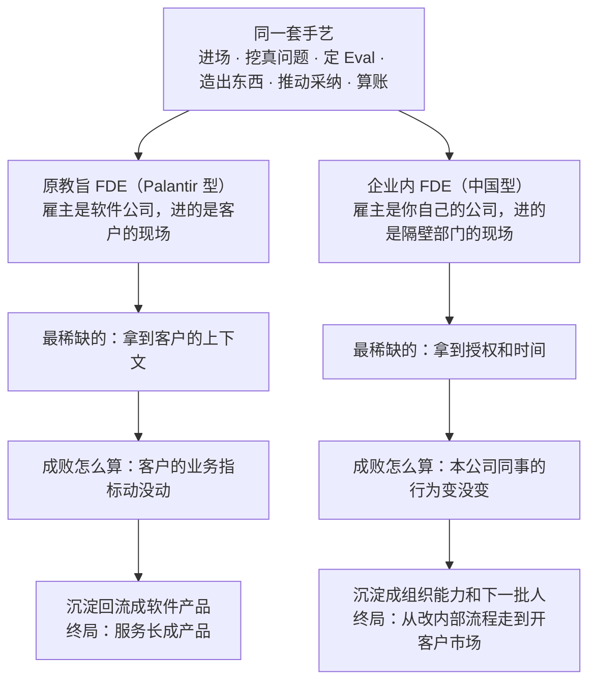

# 第 1 章 都买了 AI 的公司，为什么还是没变

## 一、输给一个微信群的 AI 助手

恒岳重工是一家做工程机械的公司，总部在长沙，全国有两千三百名售后服务工程师。前年，他们给这支队伍上了一套 AI 维修助手。

这件事从立项到验收都很体面。语料是公司二十年攒下来的家底：整机和主要部件的维修手册、四十多万条历史工单、培训中心的全套课件、历年发出的故障通报。检索和问答的链路是外面一家技术公司搭的，做得也不含糊，验收会上跑了一套两百道题的测试集，准确率 85% 以上，现场随机抽问了十几个故障，答案挑不出毛病。App 做了 iOS 和安卓两个版本，全国两千三百多名服务工程师的账号在两周之内全部开通。分管副总在总结里写的是"售后知识体系完成数字化"。

四个月后，这套系统的周活跃用户是 37 人。

两千三百个账号，每周真正打开过一次的是 37 个，这 37 个里面有 9 个是项目组自己的人。

有意思的地方在于，这四个月里，公司的售后知识体系其实一直在高强度运转，只是不在任何一份汇报材料里。它是一个微信群，群名叫"服务技术交流"，四百三十多人，群主是华东区一位干了十九年的老师傅。这个群每天几百条消息，从早上七点响到晚上十一点。有人在群里发一张漏油的照片，配四个字"这啥毛病"，三十秒之内一般就有人回："先导阀那儿吧，滤芯拆下来看看。"

公司花钱买的系统没人用，公司没花钱的那个群一天几百条。这两件事同时成立了四个月，没有人觉得需要解释一下。

项目组内部吵过一轮。技术那边认为是模型不够强，主张换更大的模型、继续调检索精度、把测试集准确率从 85% 拉到 92%。业务那边认为是推广不到位，主张让总部发文，把 App 的使用次数写进服务网点的月度考核。两边都有道理，两边都拿不出证据。而管理层的耐心是以周计的，再过一个季度没有起色，这个项目就会安静地进入"已上线、已归档"的名单，成为公司内部再也没人提起的一次 AI 尝试。

后来接手这件事的人做了一个当时看起来非常不划算的决定。他没有改系统，他去跟车，跟了十天。那十天他看见了什么、回来之后把哪里改了，第 6 章和第 9 章会整章讲。

这一章要先把他出发之前的那个问题问清楚：为什么一家把钱、语料、账号和考核都给足了的公司，最后输给了一个没人管理的微信群。

（恒岳重工这个故事根据真实案例脱敏改编，公司、人物、数据均为示例，仅用于说明流程）

## 二、中间缺的那一层

这件事本质上不是技术活。

不是员工懒。两千多个服务工程师每天在工地上跟设备较劲，他们不用这个系统，是因为这个系统在工地上帮不上忙。也不是工具差。同一个模型、同一批底层语料，后来在同一批人手里被用了起来，说明工具从来不是瓶颈。

中间缺的是**进到业务里去、把流程和产品一起改掉的那个人**。这句话是这本书的地基。

这个人得同时具备三样东西。他要能在工地上跟车跟够十天，看见工程师手套上的那层机油；他要能自己动手把语料结构和回答顺序改掉，而不是提一个需求单等三个月排期；他还得有权把"把 AI 放进微信群"这种事定下来，而不用先去说服 IT、信息安全、售后和市场四个部门。

在中国企业里，这三样东西通常分给三个不同的人，坐在三个不同的部门，向三个不同的领导汇报。跟车的人没有改代码的权限，改代码的人没有进工地的时间，有权拍板的人两样都不干。于是就有了那种熟悉的场面：AI 助手全员开通了，动员会开过了，六个月后打开率报表还挂在那里，业务数字一个都没动。

这几年我在帮几家企业做 AI 转型，看到的卡点几乎全长一个样。老板以为自己缺的是模型，IT 以为自己缺的是预算，业务以为自己缺的是时间。真正缺的是那一层人，而那一层人在大多数公司的组织架构图上根本不存在。

## 三、三组数字

判断得有数字垫底，我垫三组。

**第一组是坏消息**。

两个数字并排放，缺口就出来了。斯坦福 HAI 的《2026 人工智能指数报告》说，全球 **88% 的组织已经在至少一项业务里用上了 AI**。麦肯锡 2026 年的全球 AI 调查说，**只有 1% 的公司自认达到了 AI 成熟**——把 AI 深度嵌进核心业务、并且产生了系统性价值的企业，百里挑一。

MIT 的 NANDA 项目从另一头验证了同一件事。他们研究了 300 个公开的企业 AI 项目，结论是 **95% 的企业生成式 AI 项目对损益表没有可衡量的影响**。绝大多数公司花了钱，账上看不出来。

那 87 个百分点丢在哪儿了？腾讯研究院 2026 年 7 月发布的《前线共创 双向赋能：FDE 模式行业观察与实践》给出了一个很具体的机制回答，它叫"80/95/99 规律"：一个 Agent 覆盖 80% 的用例，通用大模型加简单提示词就能做到，一个有经验的工程师一天就能搭出个"挺好用"的原型；做到 95% 已经很难，模型会在特定场景下出错、行业术语理解不准、边界情况处理不了，需要大量的提示词优化、规则补充、数据标注和测试集构建；做到 99% 往往需要专人、专用平台和上万级的真实对话数据。

所以国内企业的普遍状态是：超过 70% 已经在至少一个职能里试过生成式 AI，超过 60% 仍然停留在试点或者实验阶段。卡住的从来不是模型能力，是最后那 20% 的生产工程。

**第二组是好消息，也是这个岗位正在被市场定价的证据**。

海外这边，Indeed 平台上 FDE 相关岗位从 2025 年 4 月的 643 条涨到 2026 年 4 月的 5330 条，一年增长 729%。腾讯研究院清洗了 273 条有效的海外招聘样本，覆盖 208 家公司，薪资中位数 18.75 万美元，均值 19.6 万美元。

中国这边的信号来得晚，但已经来了。截至 2026 年 7 月，国内主流招聘平台上直接以 FDE 或者 Forward Deployed Engineer 命名的活跃职位约 30 条以上，招聘主体从年初的字节跳动、蚂蚁集团、智谱 AI 这几家模型厂，扩展到腾讯、美团、360 这些互联网大厂。价格是这样的：

- 字节跳动（火山引擎）豆包 AI 大模型 FDE，月薪 3.5 万到 7 万，15 薪，年薪最高约 105 万
- 蚂蚁集团 FDE 解决方案工程专家，月薪 3 万到 6 万，15 薪
- 阿里云前沿部署工程师 FDE，20K 到 50K，16 薪，年包 38 万到 96 万
- 智谱 AI 的 FDE 负责人，月薪 6 万到 8 万

再往下看是一个已经分好层的薪酬结构：初级偏实施的 8K 到 25K 一个月；中级、要能做 AI 应用开发和客户现场交付的 25K 到 45K；面向大模型平台和重点客户、要做复杂端到端部署的高级岗 45K 到 70K；能带团队、能沉淀方法论的 FDE 负责人，60K 到 85K 一个月，或者年包 80 万到 150 万以上。

30 条这个数字严重低估了真实规模。国内大量实质上承担 FDE 职能的岗位，今天还挂在"AI 解决方案架构师""大模型落地工程师""AI 交付专家"这些名字底下，还没有统一到 FDE 这个标签上。

**第三组是产业级的动作**。

2026 年 5 月的同一天，OpenAI 宣布成立 OpenAI Deployment Company，并拟收购 Tomoro 这家应用 AI 咨询与工程公司，交易完成后带来约 150 名有经验的 FDE 和部署专家；Anthropic 同日宣布组建专门的部署团队。这两家公司手里握着全世界最强的模型，本来最没有理由派人去客户现场蹲着。它们仍然派了，而且在加派。

中国的头部厂商在做同一个动作。腾讯云在 BOSS 直聘上发布的"AI 前线部署工程师 FDE"岗位，把这个角色定义成"客户现场的技术 CTO + 全栈 AI 工程师 + 业务咨询顾问"三位一体。商汤科技依托自有的 AI 基础设施组建了 FDE 专家团队，覆盖战略规划、场景洞察、端到端落地和组织赋能四个能力维度。

三组数字放在一起说的是同一件事。需求侧的失败率已经被量化，供给侧的价格已经被抬起来，连模型的生产者本人都开始往客户现场派工程师。

但它们只回答了"这个岗位很重要"，一个都没有回答"中国企业该从哪里得到这批人"。

而且腾讯研究院那份报告在做中美对比的时候，把难点直接写在了表上：国内 FDE 的整体薪资低于海外 30% 到 50%，国内 2B 项目利润率偏低、高薪覆盖面有限，现场授权程度不足，交付容易陷入一次性定制。

这本书要回答的是后一个问题。

## 四、两种 FDE，得先分开定义

FDE 的全称是 Forward Deployed Engineer，前线部署工程师。字面意思就是它的做法：把工程师派到客户的工厂、医院、机房里去，坐在业务旁边写代码。这个岗位不是 AI 时代的发明，二十多年前就出现在 Palantir 这家美国数据平台公司里，今天所有关于 FDE 的讨论，源头都能追到那里。

但在讲来历之前，必须先把定义拆开，因为这本书后面讲的 FDE，和 Palantir 的 FDE 不是同一个岗位。你如果带着 Palantir 那个岗位的印象往下读，会觉得这件事跟自己没关系——那是一家美国软件公司派人去客户现场，跟一家长沙的工程机械公司有什么关系。

原教旨的 Palantir FDE，本质上是一个产品策略岗位，而不只是一个进入市场的策略岗位。这句话的意思是，这个人的产出不止于把东西卖进去、交付掉。Palantir 今天一半以上的收入来自前线抽象出来的通用组件，而这些组件都是先在某一个客户的现场被造出来、再被抽象成产品的。决定这家公司下一个产品长什么样的，是前线那批人在客户那里看见的东西。这不是销售策略，是产品策略。

而 Palantir 这条路要跑通，需要一个愿意为外部驻场长期付高价的甲方市场。这个前提在中国不成立，上一节那张中美对比表已经露出了一角，第六节会把这笔账完整算一遍。所以中国企业眼下真正能走的，是把 FDE 放在自己公司内部的那一条。

企业内部的 FDE 是另一种角色。他的任务是：让企业里面已经 AI ready 的这批人，去提高整个公司组织的 AI 水平，带着整个组织完成 AI 转型。

同一套手艺，往外做一遍和往内做一遍，从哪里分的岔，摆在一起就清楚了。



*图注：岔口在顶上那一格的下一行——雇主是谁。同一套动作，往左做一遍是在给别人的公司创造资产，往右做一遍是在给自己的公司创造资产，而这一个字的差别，会一路决定后面每一格该怎么填。*

**这本书教的是右边这一支，手艺借的是左边那一支**。所以下一节不是一段美国公司史，是这套手艺的来源，只讲三样，讲完就回中国；至于中国为什么走不通左边那一支，是第六节的全部内容。

## 五、手艺是从哪儿来的

把工程师派到客户现场这件事，Palantir 干了二十多年。这家公司给情报机构、军方和大型企业做数据平台，FDE 这个岗位就是他们发明的。关于这家公司内部怎么运转，最完整的一份一手记述来自 Nabeel Qureshi，他 2015 年入职伦敦办公室，做了近八年 FDE，2024 年离职之后写了一篇长复盘。下面三样东西出自他和 Palantir 的公开材料，也正是这本书后面九站要借的三样。

**第一样，题目的写法**

Nabeel 的第一个大项目是空客。题目是空客最高层亲自定的：把 A350 的月产量从 4 架爬到 8 架，再往 16 架走。

请注意这个措辞。空客没有说"帮我们升级数据基础设施"，也没有说"建一个数据中台"。CEO 关心的只有一件事，每个月能下线几架飞机。Palantir 接下这单的时候，把合同和自己的成败也钉在了这个数字上。

一个题目写成"月产 4 架爬到 8 架"，和写成"数据治理"，招来的是两种人，走的是两条路。前者你每个月都知道自己有没有赢；后者你永远可以说还在推进中，而且谁也不能说你错。第 5 章讲第一仗怎么选题，用的就是这把尺子。空客那个项目具体是怎么打的、团队在前几周顶着"拿不出东西演示"的压力做了什么选择，第 8 章会展开。

**第二样，一条检验公式**

Palantir 官方博客里有一句话，值得背下来：留在总部造平台的工程师做的是"一个能力，很多客户"，派到前线的工程师做的是"一个客户，很多能力"。

同一个人在同一个客户身上，把数据集成、权限、可视化、运维一层层叠上去，这是 FDE 和普通实施工程师最本质的区别，也是判断一个岗位到底是不是 FDE 的最快检验。这本书后面每一站都在用它：你是在同一个部门身上把能力一层层叠上去，还是在把同一个能力铺给很多部门。前者是 FDE，后者是推广。

**第三样，这套机器的账**

前线反复遇到的同一类问题，会被总部抽象成通用组件；组件回流成产品，产品再卖给所有客户。到 2024 年，这些从前线长出来的组件驱动了 Palantir 一半以上的收入。

它的账面结果是：2023 年 Palantir 毛利率 80%，同期 Accenture 是 32%。到 2025 财年，这个数字是 82%，还在往上走，而传统咨询公司仍在 30% 到 40% 这个区间。2016 年说 Palantir 是一家咨询公司还算成立，今天不成立了，它完成了极少有公司做到的服务转产品。

这个 80% 是下一节的全部起点。

把三样收一收。美国的答案能跑通，靠的是三个前提同时成立。

第一，有一支肯常年出差、住到客户城市去的精英工程师队伍。

第二，有一个愿意为外部驻场付高价、而且愿意先付的甲方市场。

第三，有一个能把前线的定制回流成产品、从而让高毛利成立的后方。

三个前提里，中国企业能凑齐第三个的其实不少。最难的是第二个。

## 六、中国的岔路

### 20% 和 80% 的差别

中国的软件外包和咨询这个行业，一直没有真正长起来。

这不是印象，是账面上的事。国内头部的 IT 服务与软件外包上市公司，毛利率长期在 20% 到 30% 这个区间。作为对照，上一节那两个数字：Accenture 32%，Palantir 2023 年 80%。

毛利率这个数字看起来很财务，但它决定的是一件非常具体的事。

```
同样收 100 块，这 100 块怎么分，决定了你能雇什么人、能让他待多久

毛利 20%　国内头部的 IT 服务与软件外包
  人力 ████████████████████████████████ 80　│　毛利 ████████ 20
  雇什么人　　　单价可控、可替换、按人天计费
  能待多久　　　项目结束当天撤场，立刻转下一个项目
  这段时间记在　销售成本。人待得越久，这一单越亏

毛利 80%　Palantir，2023 年（同期 Accenture 32%）
  人力 ████████ 20　│　毛利 ████████████████████████████████ 80
  雇什么人　　　最好的工程师，一个客户长期专属
  能待多久　　　把人放进空客总装厂住一年半
  这段时间记在　研发投入。赌这一单里长出一个卖给所有客户的产品
```

*图注：那 20 块要覆盖销售、管理、坏账和利润，所以第一行那套账不是不愿意派最好的人长期驻场，是账上没有这一格。同一个动作在两套毛利结构里，一个记成亏损，一个记成投资。*

合同的量级把这个差距又放大了一轮。硅谷的高价值客户可以支撑六到七位数美元的合同，而国内大量的 AI 落地项目仍然在十万到百万人民币这个量级。同样一套重交付的动作，一边摊在几百万美元上，一边摊在几十万人民币上。

所以"中国也可以做 FDE 外部服务商"这句话，在账上是不成立的。在中国做外部 FDE，实际上就是在做外包，而中国的外包行业本身就没有富裕到能养一支精英驻场队伍。

甲方这边的不信任也有来历。企业过去买过的实施项目，大多数交付的是一套按需求文档做出来的系统，而需求文档本身是甲方业务口提的，业务提得对不对没有人保证。做完之后乙方撤场，系统留在那里，两年之后没人会改。这样的经验积累多了，甲方对"外面来的人能懂我的业务"这件事，天然是打折的。

乙方这边的难处更结构性，但它不在大多数人以为的那个地方。

常见的说法是知识带不走：挖出来的东西绑死在这一个客户身上，换一家要重来一遍。这个说法不太成立。真做过的人知道，相当多的东西是能复用的——行业的流程骨架、常见的例外类型、数据口径的那些坑，换一家同行业的客户，一大半是通用的。

真正卡死这件事的是价格。

一个能理解你业务上下文、能顺着战略把流程重构掉的人，非常贵。这是事实，不是行情虚高。而企业心里那个价签是另一套：这是个软件开发的活，按人天算，参照 IT 外包报价。

所以这笔交易从第一天起就对不上——**你要请的至少是麦肯锡这个档次的人，你打算付的是软件外包的钱**。

对不上的后果不是谈崩，是降级。乙方接了这一单，只能派最便宜的人去。派去的人挂着 FDE 的头衔，实际上要么是个开发工程师，能实现但定义不了问题；要么干脆是个能聊天的，什么都定义不了。而甲方拿到这样一次交付之后，对这个岗位的报价预期会再压一档，下一次给的钱更少。

这就是劣币驱逐良币，而且它是自我强化的。

所以结论不是中国没有好的 FDE。是在大多数公司今天的支付意愿下，你请不到。真正好的那些人也不肯来——为一笔比他自己工资还少的钱，去干一件最难的活，没有道理。至于国外那种规模化的、成建制的 FDE 队伍，在中国的价格带里根本组不起来，那笔账从第一行就不成立。

把这几条连起来，"中国也可以做外部 FDE 服务商"这件事，在今天的支付意愿下是个伪命题。

而同一笔账倒过来算，就是这本书的全部立论：**按中国 ToB 市场愿意付的这个价钱，最好的 FDE 只能是内部培养出来的**。因为内部那个人的成本已经在工资单里了，你不需要在一个项目预算里回收他，也就不需要在他身上省钱。

### 我自己在这条路上撞的墙

这几年我在帮不少公司做 AI 转型，做得最多的是讲大道理和带工作坊。

这个层面的生意其实很好做。集团层面要开战略会、要做年度规划，这种场合的预算反倒比较高，请得起我。我去讲一次两次，讲完大家很兴奋，付款也很爽快。听我讲课的十个项目，十个都会付钱，因为总共也就是一两次课的事。

真到要落地的时候，事情就变了。

我说落地我要带最好的团队进来，这批人的成本摆在那里。对面听完，几乎每一家都会绕到同一个问题上：能不能按业务效果付费。你先做，做出效果我再给钱，做不出效果我不给。

甲方的这个要求本身很正常。他们见过太多做完就走、留下一套没人会改的系统的乙方，所以要见了兔子再撒鹰。

但按效果付费这件事，我这边接不住。最好的人在项目最早期的投入是最重的，那段时间没有任何效果可言，成本却已经实打实地花出去了。而且我自己心里也清楚，我不能保证一定能出效果。我这边用最好的人，那我就得要更高的价钱；我要更高的价钱，甲方就更要把风险往后推。两边都在讲道理，于是大家一起卡在半路上。

数字是这样的。讲课的项目十个里十个都付款，因为便宜。但真要动手做，**十个到二十个里面才能转化成一个订单**，愿意付那个价格。付了那个价格的项目里，**三个里面才有一个是推进顺利的**，另外两个会卡在各种地方——数据拿不到、对接的人换了、老板的注意力转移了、业务口径吵不清楚。两个环节乘起来，成功率连三分之一都不到。

我还试过换一种收钱的方式。我试着在中国做 AI roll-up。这个词的意思是，不收服务费了，改成用资本合作的方式并购或者占股，把客户公司买下来一部分，我带人进去用 AI 把它的效率提上来，我赚的是这家公司变得更值钱之后我那部分股份的增值——那才是大钱。这条路在美国有人在跑。在中国我遇到了很多实际的困难。

所以我的结论是：**只要是第三方来做这件事，而且要做得深，整个激励结构在今天很难设计得当**。

这不是某一家乙方能力不行，也不是某一家甲方不开明。这是一个各方都在按自己的合理逻辑行事、最后一起停在半路上的结构。

### 一个注脚

2023 年到 2025 年，澜码科技是国内把这件事想得最清楚的公司之一。创始人周健是 ACM 世界冠军，有 Google 和阿里的技术背景，他给出的方法论是三步：专家知识数字化，用对话界面做柔性交互，领域知识循环沉淀。同期不少同行在堆客户 Logo 和"效率提升 300%"这类没有分母的百分比，澜码讲的是周数、条数、金额——保险行业那个项目沉淀了 10 万余条寿险产品与销售的专家知识，教育行业的项目 5 周完成了 13 类基础题型的验证。2025 年初，公司陷入资金链困境，大规模裁员，周健公开回应称正在寻求被并购。

一家公司的结局定不了一个模式的生死。把这一段放在这里，是因为它是走得最远的一个样本，而它撞上的正是上面那两节讲的结构。

## 七、我的判断：内部培养

所以中国真正可能走通的路径，是**内部培养 FDE**。

这批人本来就懂你的业务。你不是招一个麦肯锡的人来学你的业务，而是让已经懂业务的人来学 AI。后者要容易得多，因为没有谁知道 FDE 该怎么做，真的没有人知道。AI 是个新东西，全世界的人都只上手了两三年；而你的业务是个有很久积累的东西，你的人在里面泡了十年二十年。所以外面的 FDE 不见得比你内部的 FDE 强多少。现在正好是一个培养内部 FDE 的窗口，性价比最高。

把这个判断翻译成一笔可以算的账，是四项成本的对比。

```
同一件重活，两条路各自要背的成本

外部交付
  知识的获取  ████████  从零挖，一条一条掏
  信任的建立  ████████  先花半年，业务方才肯讲实话
  资产的归属  ████████  挖出来的归甲方，换一家客户重来一遍
  人的薪资    ████████  必须从这个项目里赚回来

内部培养
  知识的获取  ▏         他本来就有
  信任的建立  ▏         他本来就有
  资产的归属  ▏         留在自己公司，不存在带不走
  人的薪资    ██        已经付在工资单上了
```

*图注：这四份不是外部服务商效率低造成的，是"人在外面"这个位置本身带来的，换一家更能干的乙方一份也省不掉。定价上必须先把它们装进去，而中国的甲方市场目前不愿意为它们付钱——上一节那堵墙，全部内容就是这四行。*

### 一群不该给出这个建议的人给出了这个建议

这不只是我的判断。

第三节反复引到的那份《前线共创 双向赋能：FDE 模式行业观察与实践》，是国内目前关于这个岗位最完整的一份公开研究。它的材料来自三处：腾讯云区域架构师团队和教育、传媒、文旅、政企各个行业团队的一线访谈；智谱 AI、百度云、火山云、阿里云、毕昇（BISHENG）等一批机构伙伴的深度交流；以及对国内外招聘市场的系统采集——海外清洗出 273 条有效职位样本，国内对 BOSS 直聘、猎聘、智联招聘做了专项扫描。

它在人才那一章给出的核心判断是：**FDE 不能全靠外部招聘，更可行的路径是从现有的架构师、解决方案、交付和行业专家里选拔不同能力类型的人，建立项目制的培养机制**。给 HR 团队的那条实操建议写得更直白：不需要大量新增岗位，关键是现有角色的能力转型；深耕行业的解决方案架构师，是最接近完整 FDE 能力模型的现有角色。

请留意说这话的人是谁。腾讯云自己在卖智能体开发平台，自己在 BOSS 直聘上招 AI 前线部署工程师，自己的 CodeBuddy 团队已经在向企业客户单独收 FDE 陪跑服务费，金额从百万级到五百万级不等。这是一家完全有理由告诉你"这件事很难、你自己搞不定、交给我们"的公司。它没有这么说。它说的是，这批人应该从你公司现有的岗位里长出来。

同一章里还给了一条培养节奏，四段：头 0 到 3 个月学平台、学工具、跟项目；3 到 9 个月独立承担模块，开始直接面对业务方的问题；9 到 18 个月独立跟进中小项目，形成自己的行业判断；18 个月以后，才谈得上有重新定义问题的能力。

以及一句话：这套能力是在真实问题里练出来的，课堂教不出来。

这句话是这本书第二部那九站的设计前提。

### 样子已经有人跑出来了

安克创新 2023 年提 All in AI，执行这句话的是 CIO 龚银和他带的 IT 与数字化团队。他们没有请外部咨询公司来教怎么做 AI，也没有把这件事外包出去。推 AI 的是原本就在公司里、原本就懂业务系统的那批人。

他们的做法有四个动作可以直接抄。

第一，先玩起来再谈立项。一年内办了多次 AI 专场 Hackathon，产出 50 多个"业务 + AI"的候选场景。注意这是 50 多个候选，不是 50 多个立项。先大面积铺开让业务和 AI 互相碰，摸清能力边界之后再收敛。

第二，把使用变成看得见的行为。全员开放一个可以自由探索的 AI playground，把门槛按到最低；飞书机器人每周把使用次数最多的员工排名推送给所有人；内部社区里沉淀了 700 余条使用经验的热门帖子。

第三，责任挂到一号位。AI 提效被列进部门一号位的 OKR，CEO 阳萌本人每周 review 各项 AI 提效的进展。这两个动作合起来，才是"老板重视"这四个字的可执行版本。

第四，团队一分为二。约三分之一的人承担明确的 ROI 指标和时间节点，其余三分之二专注不确定性领域的探索，不设短期 ROI，但要定期汇报进展。

三年下来最硬的那个数字是 AI 代码采纳率：2023 年 30%，2024 年 37%，2025 年突破 50%。

另一面也要讲，否则就成了鸡汤。安克的创业小组制对事业部负责人要求极高，公开报道称社招高 P 的被动离职率偏高，2025 年内有两位业务负责人先后离职，其中一位带走了近 30 人的团队。研发投入年增 37.2% 的同时，2025 年经营活动现金流净额只有 4.81 亿元，比上一年跌了 82.49%，任何一笔投入都会被问回报。这个两难他们自己也讲得很直白，第 10 章会展开它，因为那正是你带第二个人、第三个人时要面对的题。

这一面恰恰说明，内部 FDE 最稀缺的能力不是技术，是接得住老板跳跃的战略，然后把它翻译成一个一个能落地的场景。

**你的下一个 FDE，正坐在你公司办公室里面某一个工位上**。

这条路在中国还没有几个人完整走完过。安克是目前公开材料最完整的一个。这本书不是在总结一个已经成熟的实践，是在把一条我判断成立的路径，尽可能具体地铺出来。对错算我的。

## 八、贯穿全书的三个判断

上面那些是已经发生的事。接下来这三条是我对未来的假设，它们贯穿全书，也决定了这本书为什么这么写。三条之间有先后：第一条讲什么已经不值钱了，第二条讲剩下那件值钱的事该怎么干，第三条讲为什么每一家公司都躲不掉。

### 判断一：E 已经不值钱了，而且还在贬值

**字面意思**：FDE 这三个字母里，Engineering 那一截是最不值钱的一截，而且它每天都在继续贬值。而绝大多数人来找 FDE，想买的恰恰就是这一截。

**为什么成立**。

先说一个词。做 AI 应用，光有模型是不够的，还得给它搭一层外壳，才能把它接进业务里——工具怎么调、提示词怎么写、结果怎么评、多个步骤怎么串起来。这层外壳英文里叫 harness，本义是挽具，套在马身上让它能拉动车的那副东西；腾讯研究院把围绕它的这套活儿译成"驾驭工程"。模型是马力，harness 是让这股马力真的能拉动车的那副挽具。

去年打一副像样的 harness，需要两个月。今年打一副，两周。到今年年底，我判断两天就能搞完。

技术本身已经是 commodity，而且还在越来越简单。一个每天在变便宜、变简单的东西，不可能是瓶颈，更不可能是你花大价钱买的那个东西。

腾讯研究院那份 FDE 报告用另一句话说了同一件事：AI 让工程执行变便宜，让判断能力更稀缺；前线角色正在从"写代码的人"演变成"指挥 AI 完成业务的人"。它对未来的推演更直接——低端实施会被工具持续替代，而定义问题、建立信任、沉淀行业知识这三样会继续升值。

同一家机构今年 6 月那份《从超级个体到超级团队》，把这件事说得更狠：

> 表面上洗的是技能，但 AI 几乎抹平了技能这一层，真正被重新定价的是它底下那层更难命名的东西：判断力、学习速率、问题分解、品味。难处在于，现有的人才体系衡量的几乎都是正在贬值的那一层。

现有的人才体系衡量的是正在贬值的那一层——这句话换到 FDE 这个岗位上，就是：市场花大价钱买的是 E，而 E 正是那层在贬值的东西。

那真正值钱的是什么？是业务梳理，是业务理解，以及怎么把这两样跟技术匹配上。

所以 FDE 不要把 E 当成最重要的事，不要一头扎进去学一堆有的没的技术。重点是 Forward Deployment 这两个词：**考虑的是 Fit，考虑的是 Discovery，不是 Engineering**。

**它在这本书里对应哪部分**。第二部里最长的两章都压在这上面：第 5 章讲怎么选第一仗，第 6 章讲怎么把一句模糊的抱怨挖成一个可解的问题。那两章讲的全是 Fit 和 Discovery，一行 harness 的代码都不讲。

### 判断二：FDE 本身也应该 agent 化

**字面意思**：帮别人做 AI 转型的这套流程，它自己首先就应该是 AI 干的。

**为什么成立**。

先看看现在这件事有多别扭。一帮号称很高科技的搞 AI 的人，用最原始的人力密集型方式——上门访谈、坐在会议室里记笔记——帮你做业务梳理，然后交给你一套东西，号称这套东西能把你所有的业务都自动化。**这件事说不太通**。

所以 FDE 的整个流程本身应该 agent 化。agent 指的是那种能自己调用工具、分步骤把一件事从头做到尾的 AI 程序，而不是你问一句它答一句的聊天框。调研提纲的生成、访谈纪要的结构化、数据源的探查和清洗、评估集的初稿、复盘报告的初稿，这些环节都应该大量交给 agent 去完成。只有这样，这件事才谈得上标准化交付，而不是每一次都靠某个人的手艺重来一遍。

对企业内部来说，这一条是内部培养能不能成立的关键。

如果 Discovery 和业务梳理的整套流程是由 agent 来控的，那它就不要求每一个人都三头六臂、把那么多本事全学会——**可复制性才强**。反过来，如果这套方法论只存在于某几个高手的脑子里，那企业内部确实很难培养：你好不容易带出一个，他一走，链条就断了。但如果有一套明确的工具，企业内部拿去用，这件事就成立了。

这一条还顺手把入场的门槛拆掉了一层。过去一家两千人的制造企业想在内部做这件事，第一个障碍是根本凑不出一支懂数据、懂前端、懂业务的队伍，只能对外采购。今天这个障碍塌了。**内部培养 FDE 从建一个部门，变成了腾出一个人**——一个人，加上给这个人的授权和时间。

**它在这本书里对应哪部分**。第 8 章讲这支 AI 军团具体怎么编队；第二部的九站，每一站都会给出这一站该由人做、该由 agent 做的分工。

### 判断三：每家公司都必然要培养 internal FDE

**字面意思**：internal FDE，也就是公司自己内部的 FDE。这件事今天已经不是要不要做的问题，是每一家公司迟早都得做的事。

**为什么成立**。

要看清楚这一条，得先把这个能力从"帮公司内部提效"这个框里拿出来。

表面上看，内部 FDE 干的都是内部的活：改内部流程、帮同事把事搞定、调动公司现有的资源让一件事做得更好。但把他的动作拆开看，这套能力的本质是：**在内部定义一个客户，去看这个客户的问题到底是什么、流程到底是什么，然后用好 AI 这个十倍速变化的要素，生产出新的生产力，去更高效地解决他的问题**。

这套能力换个方向，一个零件都不用换。

你要开拓一块新市场，要做一个 AI 原生的产品，要用 AI 给自己现有的产品加码——做的是同一件事：**把外部的客户当成内部的客户**，去看他要解决的问题是什么，然后用 AI 加上组织已有的资源和组织能力，帮他把事搞定。

所以它根本不是一个对内提效的工具。它是一脉相承、可以反复复用的一套东西，**是未来公司的核心能力**。

而核心能力这四个字有一个推论：核心能力不能外包，只能自己长。你可以把清洁外包、把物流外包、把一部分开发外包，但没有哪家公司会把决定自己下一个产品长什么样的能力外包出去。这就是为什么每一家公司最终都必然要培养自己的 internal FDE——不是因为外面的人不够好，是因为这件事一旦外包，你就永远不会拥有它。

**它在这本书里对应哪部分**。第三部。第 11 章讲从对内提效到对外开拓这个转向具体是怎么发生的，第 12 章讲为什么走完这条路的人往往会去创业。

### 三条收口

Engineering 没有那么重要了，业务比较重要。

梳理流程这件事，帮忙没有那么难了。

未来每一家公司都需要这套能力——而且需要的不是租一套，是自己有一套。

---

回到开头那家工程机械公司。那十天里，管理层眼里的项目状态是"毫无进展"。跟车的人顶着这个评价把十天跟完了，回来才知道该改什么。

我不知道你公司里那个能跟这十天车的人是谁。但我几乎可以肯定，他今天正在某一个和 AI 完全无关的会议室里，被一件别的事耽误着。

---

*下一章：[第 02 章 培养旅程全景](第02章-培养旅程全景.md)——把一个内部人带成 FDE 的九站，三条铁律，以及这套节奏是从哪儿借来的。*
