# 第 2 章 培养旅程全景：把一个内部人带成 FDE 的九站

> **第一部 · 全景**　这一章是地图，不是方法。看完你应该知道这趟旅程有几站、每一站要赢什么、以及为什么最难的是第 4 站和第 5 站。

| 这一章 | |
|---|---|
| **给你什么** | 九站全景、三条铁律、选造用算的出处谱系 |
| **要你记住的** | 每一站的过关标准都是别人的行为，不是你的产出 |
| **两个读者** | 负责人读前两站和最后两站；FDE 读中间五站 |
| **读完去哪** | 附录 A 那张九站全表可以撕下来贴墙，这一章是它的说明书 |

**这一章的四块**

| | 内容 | 干什么用 | 在哪节 |
|---|---|---|---|
| ① | 九站全景图 | 知道自己现在在哪一站，下一站要赢什么 | 三 |
| ② | 三条铁律 | 开工前负责人和 FDE 当面约定的三件事 | 四 |
| ③ | 选造用算的出处 | 你在公司里推这套东西时，说得出出处比说不出好用 | 五 |
| ④ | 明远家电走前四站 | 看一遍这趟旅程真实的样子，高潮留给正章 | 六 |

## 一、"我们该招个什么人"

去年冬天在杭州，一位做家电的老板请我吃饭。菜还没上齐他就把问题抛过来了：我们也想搞 AI，该招个什么人？

我问他打算让这个人干什么。他说，先把公司的 AI 落地起来。

我又问，落地到哪个部门、哪条流程、解决谁的什么事。他愣了一下，说这不就是要招来的人帮我想的吗。

这顿饭后来我们聊了三个小时，聊到最后他有点不高兴。因为我给的答案是别急着招，先看看你公司里现在坐着的人。一个老板已经下了决心要花钱，你却告诉他这件事花钱解决不了，这话听起来确实像敷衍。

但我不是在替他省钱。我是判断他要招的那个人很可能根本招不到；就算招到了，也大概率会在第四个月卡住，卡在他自己都说不清楚的那个问题上。

理由上一章讲过。卡住项目的不是模型，是真实的问题、真实的 Context、真实的 Eval 这三样，而这三样有一个共同点：它们都长在你的业务内部。一个外来的人要拿到它们，先要花半年时间让一线愿意跟他说实话，再花半年时间把业务学懂，一年过去了才刚到起跑线。而你公司里那个已经懂业务的人缺的只有一样，就是不会用 AI，这件事今天比任何时候都容易学。

所以这一章讲的不是怎么外包一个 AI 项目，是怎么把一个已经坐在你公司里的人，用一仗的时间带成内部 FDE——这个岗位不从外面派进来，从你自己人里长出来。

下面九站，是这一仗的全程。

## 二、这趟旅程同时写给两个人

内部 FDE 不是自己长出来的，是被两个人一起带出来的。所以这份旅程从头到尾同时对两个人说话。

第一个人是负责人。他可能是 CIO、CAIO、某个事业部老板，公司小的话就是老板本人。他手里有三样别人没有的东西：出题的权力、给授权的权力、验收拍板的权力。整趟旅程里，他亲自下场的是开头的选人和授权，回来收尾的是最后的算账和带第二个人。

第二个人是被选中的那个人，也就是未来的内部 FDE。中间从选题到推采纳这五站，是他一个人扛的。他现在还是个业务岗，可能是运营主管、可能是财务分析、可能是车间技术员。

这两个身份是两顶帽子，不是两个必须由两个人戴的帽子。公司足够小的时候，老板既出题又下场，一个人戴两顶完全可以。但两顶帽子必须分开戴，也就是说，你当负责人的时候必须能对自己扮演的 FDE 说"这一站没过"。两顶帽子糊在一起，后面所有的过关标准就都失效了，因为没有人再来验收。

每一站都有明确的主角，写在那一站的开头。看到不是自己那一站也别跳过。你需要知道对面在干什么，这一仗才不会在交接处掉链子——中国企业里的 AI 项目，死在交接处的比死在技术上的多。

## 三、这九站分别叫什么

九站分三段。**选人**和**授权**是开工前的两站，负责人亲自下场。**选题**、**挖真问题**、**定及格线**、**造**、**推采纳**是这一仗本身，FDE 一个人扛。**算账**和**带第二个人**是打完之后的两站，两个人一起做。

```mermaid
flowchart LR
  subgraph A["负责人下场｜开工前，不计入 30 天"]
    S1["01 选人<br/>过关：他本人当面点头"]
    S2["02 授权<br/>过关：日历真的被清空"]
  end
  subgraph B["FDE 一个人扛｜这一仗本身，30 天到 8 周"]
    S3["03 选题<br/>过关：老板在立项书上签字"]
    S4["04 挖真问题<br/>过关：业务方说对，就是这个"]
    S5["05 定及格线<br/>过关：业务方认下及格线"]
    S6["06 造<br/>过关：真实用户自己上手"]
    S7["07 推采纳<br/>过关：连用五天并说有用"]
  end
  subgraph C["两人一起｜算账收在 30 天内，带人在其后"]
    S8["08 算账<br/>过关：老板当场拍板"]
    S9["09 带第二个人<br/>过关：第二个人被点名"]
  end
  S1 -->|一个人名| S2
  S2 -->|授权书与空日历| S3
  S3 -->|一页立项书| S4
  S4 -->|一句问题描述| S5
  S5 -->|一条及格线| S6
  S6 -->|一个能跑的东西| S7
  S7 -->|一份使用记录| S8
  S8 -->|一本交付病历| S9
```

*图注：三条泳道换的是主角，箭头上写的是交接物。上一站没有交出箭头上那件东西，下一站看起来照样可以开工，只是从第一天起就在空转——这就是"死在交接处"的具体样子，它不产生任何报警。*

这张图分的是主角，不是动作。"选造用算"那四个字分的是动作，边界和这三条泳道对不齐——它只覆盖中间那一仗，两头的选人、授权、带第二个人都不在四字里面。所以那套对应关系单独放在第五节讲，不叠在这张图上。

每一站的典型耗时、agent 干什么、人必须自己守哪个判断点，全在附录 A 那张可以撕下来贴墙的主表里。

时长写在图里那三个泳道的标题上了。这里只补一句：选人和授权之所以不计入这 30 天，是因为它们是开工前的准备，而这两件事做不彻底，后面五站会全部返工。

带第二个人这一站的地位需要特别说一句。它看起来像收尾，实际上它是这套东西唯一的意义所在。一个 FDE 是个案，说明你运气好、挑对了人；第二个 FDE 才是能力，说明这条路能被走第二遍。所以这一站的过关标准写的是"第二个人被点名，而且不是你"——只要那个人还是你，这家公司拥有的就仍然只是一个人，不是一套方法。

再把图上那九行"过关"连起来读一遍。没有一样是你自己的产出：签字、认账、上手、连用、拍板、被点名，主语全是别人。这不是修辞，它是下面第一条铁律的来源。

## 四、三条铁律

这三条铁律，是负责人和 FDE 两个人在开工之前当面约定下来的，最好写进那封授权书里。约定的场合是这个人在这家企业内部打的第一仗——第一个项目、第一个 30 天、第一次向老板交答卷。

约定的目的是防两件事。

第一件叫 POC 化。POC 是 proof of concept 的缩写，概念验证。做出一个演示，会上放一遍，大家鼓掌，然后就没有然后了。

第二件叫烂尾。项目没有失败，因为没有人宣布它失败；它只是安静地从所有人的日程里消失，三个月后没人再提起。

### 铁律一，每一站的过关标准都是别人的行为，不是你的产出

自己觉得做完了，不算完。

对负责人来说，这条的意思是：不要用"做到什么程度了"问进度，要用"谁做了什么"问进度。"PPT 写好了"不是进度，"张师傅昨天自己登录用了三次"才是进度。前者你只能听他说，后者你可以自己去查。

对 FDE 来说，这条的意思是：你交不出别人的行为，就是没过关，哪怕你这周写了三千行代码。

这一条防的是 POC 化。POC 化的全部机理就是产出很漂亮，但没有任何一个人的任何一个动作因此改变。只要过关标准锁死在别人的行为上，POC 化在结构上就不可能发生——因为演示是不产生行为的。

这一条是整套方法的脊椎。把它删掉，剩下的只是一张排期表。

### 铁律二，AI 控流程，人控判断点

访谈提纲、录音转写、数据摸底、代码、评估集初稿、汇报草稿，这些全都可以交给 agent，而且交给 agent 干得更快更全。这里说的 agent，指的是能自己调工具、自己跑多步任务的 AI 助手，不是只会一问一答的聊天框。

但每一站那个"别人的行为"必须由人去赢。业务方肯不肯在及格线上签字，一线肯不肯连着用五天，这些事没有一件是 agent 能替你去争取的。

对负责人来说，这条的意思是：不要因为"AI 都能干了"就减配这个人的时间。这个人的价值在判断，而判断需要他在场——在跟车的副驾上，在车间里，在业务方的工位旁边。

对 FDE 来说，这条的意思是：在判断点上偷懒，AI 只会把你的错误跑得更快、铺得更广。哪些环节属于判断点，本章第七节按三层列了出来。

这一条防的是一种新型烂尾。东西造得飞快，两个月造了三版，但从来没有人真的想清楚要解决什么，最后发现方向从第一天起就是错的。这种烂尾比传统烂尾更贵，因为它烧掉的不是钱，是这家公司里所有人对 AI 这件事的耐心。

### 铁律三，打不赢就止损复盘，烂尾才是唯一的失败

"停止"是一个合法结局。第 30 天向老板汇报"这个场景现在不值得做，原因是这三条，建议半年后重看"，这同样算赢，而且是一种很值钱的赢——它省下的是后面三个季度的投入。

对负责人来说，这条的意思是：你必须在开工前当面把这句话说给 FDE 听，而且要说得他相信。你不说，他就只能报喜；他只能报喜，你后面拿到的就永远是假数据，你就会在假数据上做真决策。中国企业里最贵的成本不是失败本身，是没人敢说失败、于是项目被一直续命带来的持续投入。

对 FDE 来说，这条的意思是：有了这句承诺，你才敢用真实数据、真实死线干活。否则你会本能地把题选得容易一点、把数据挑得干净一点，好保证自己交得出一个能看的结果。

这一条防的是烂尾。烂尾的定义不是失败，是没有人宣布结束，所以也没有人总结教训，所以下一个人还会原样再踩一次。

安克创新是做消费电子出海的深圳上市公司，充电器、耳机、扫地机这些品类。他们的 CIO 龚银把这条铁律的实践版说得比我狠。他们 2023 年投人做了一个 AI 内容中台，到 2024 年下半年，因为模型能力变了、原来的价值点转移了，他的处理是"我们果断把这个平台重新做了，接受失败"，以及"AI 平台一旦过时，我们将毫不犹豫地选择重构"。一家上市公司的 CIO 愿意在公开采访里说出这两句话，等于当着全行业的面把自己的沉没成本一笔勾销——这就是这条铁律在真实企业里的样子。

## 五、选造用算：这四个字是从哪儿借的

九站是叙事线，讲的是时间顺序。选、造、用、算是节奏骨架，讲的是这一仗的四个动作。对应关系一次说清：选题、挖真问题、定及格线这三站属于"选"，造那一站是"造"，推采纳是"用"，算账是"算"。开头的选人和授权在这一仗之前，结尾的带第二个人在这一仗之后，都不在这四个字里。

这四个字是我起的，但四段节奏各有出处，都是别人在比中国企业内部更苛刻的条件下验证过的东西，我做的是把它们改造成中国企业内部版。把出处摆出来有两个用处：一是你能自己回去读原文，判断我改得对不对；二是你在公司里推这套东西的时候，说得出出处比说不出出处好用得多。

### "选"借自 Palantir 的 AIP Bootcamp

选这一段借的是一张入场券：真实数据、亲自上手、三方到场，缺一不可。

Palantir 是那家给情报机构、军方和大型企业做数据平台的美国公司，FDE 这个岗位就是他们发明的。AIP 是他们 2023 年推出的 AI 平台产品，Bootcamp 是配套的客户集训营，把"从零到跑通一个真实用例"压缩到 1 到 5 天。

这个集训营有三条硬约束，我全盘继承。第一，客户必须自带真实业务数据和真实业务问题，不能用样例数据，也不能用假设场景。第二，客户自己上手敲键盘，不是坐着看演示。第三，到场名单三方缺一不可——业务负责人、最终用户、IT 干系人。

我改的地方是主语。在 Palantir 那里，这份清单是卖方给买方的入场券，背后有 Palantir 的品牌势能撑着，客户不答应就不给排期。内部 FDE 没有这个势能，一个售后主管没法要求副总必须到场。所以我把这份清单改写成了内部 FDE 递给自己老板的开工前协议，并且在话术里明写一句"Palantir 给他们全球客户开集训营，用的是同一份清单"。没有势能的时候，借势的方式就是把出处摆到桌面上。

### "造"借自 Cockburn 和 Basecamp

造这一段的骨头有两根：一根是先把链路从头到尾打通再谈完善，一根是时间固定、范围可变。

这一站要造的东西叫 MVD，最小可行部署。MVD 这个说法在中文圈有它自己的流行路径，但那两根骨头都比 MVD 这个词老得多。

第一根是 Alistair Cockburn 的行走骨架（Walking Skeleton）。Cockburn 是 2001 年敏捷宣言的十七位签署人之一，用例这套需求方法的主要推动者之一。行走骨架的意思是：先做一个执行小的端到端功能的微小实现，不必用最终架构，但必须把主要组件串起来，让它能从头走到尾。出处是《97 Things Every Software Architect Should Know》第 60 篇，O'Reilly，2009 年。

第二根是 Basecamp 的三件套。Basecamp 是一家只有几十人的美国软件公司，以一整套反主流的产品开发方法出名，《Shape Up》是他们把这套方法写下来的书，全书在官网免费公开。三件套是 Appetite、Circuit Breaker、Scope Hammering——先定愿意为这件事花多少时间（Appetite，胃口），再把方案锤进这个时间（Scope Hammering，砍范围），周期结束还没做完的东西不自动滚入下一个周期（Circuit Breaker，断路器）。

我在这两根骨头上各改了一处。

Cockburn 讲的行走骨架，关节是技术架构的端到端打通——数据库、服务、前端能连起来。我把关节换成了业务链路的端到端打通：从真实数据进去，到业务结果写回业务系统出来。换的理由很实际，中国企业的 AI 落地很少死在架构上，模型是买的、云是现成的，绝大多数死在两处——数据接的不是真的，以及结果没有写回业务系统，于是没人用。

Shape Up 的标准周期是 6 周，我改成 4 周。理由也很实际：中国企业老板的注意力周期大约等于一个月度经营会。超过一个月没有可看的东西，这个项目在他心里就已经开始降级了。

### "用"借自 Palantir 的驻场节拍

用这一段借的是当日节拍：上午做出来的东西，下午就摆到用户面前。

上午写的东西，下午就进客户迭代会，一周跑四到五个完整的迭代循环。这不是一条排期建议，是 Palantir 一位部署策略师公开过的日程表里的实录，也是造那一站两周节拍的直接来源。同一份材料里还有一个数字值得记住，Palantir 的标准试点项目周期是 4 到 12 周。

我改的是它的支撑条件。Palantir 能跑出这种迭代密度，靠的是一整个团队常驻客户现场。内部 FDE 只有一个人，靠的是两样东西：一支 agent 军团替他干执行，以及他本来就和用户在同一栋楼里。

后者其实比 Palantir 更有优势。Palantir 的人要飞过去，你只需要走两层楼。这个优势大部分内部 FDE 都没有用上，他们坐在工位上等业务方回微信。

### "算"借自 Distyl 的三层结构

算这一段借的是一条从服务长成产品的路径：先下场干活，再攒下可复用的资产，最后才有资格给别人做诊断。

Distyl AI 是一家美国创业公司，它做的事情就是把 FDE 这种交付方式本身做成了商业模式。2025 年 9 月拿了 1.75 亿美元 B 轮融资，估值 18 亿美元，全公司约 200 人。两位创始人 Arjun Prakash 和 Derek Ho 都出自 Palantir，他们对企业 AI 落地的诊断是一句话：瓶颈不是模型，是运营模式。

Distyl 的业务分三层，是"服务怎么长出产品"的活教材。第一层是诊断产品，给客户输出一份 AI 就绪度评分和一张按投资回报排序的部署路线图。第二层是前线部署团队，人驻到客户现场，重构流程、部署系统。第三层是平台，把企业里那些散落的文档、跑了十几年的老系统、老员工脑子里的经验和一堆没人维护的表格，转成模型能直接调用的上下文层。

我把这三层压成了一条一个人的能力曲线：第一仗你只有中间那层，自己下场干活；第三仗开始你有了最底下那层，因为手里攒下了自己的模板和上下文资产，新项目不用从零开始；到第十仗才轮到最上面那层，你才有资格给别的部门做诊断和路线图。

这个顺序绝不能倒过来。没打过仗的人做不了诊断，他给出的路线图只是一张按行业惯例排列的愿望清单。

四段的出处摆完了，我自己做的是三件事：换场景，压进 30 天、单一部门、无预算无编制；换主语，写给一个坐在企业工位上、要说服自己老板的内部人；加一格，每张表都单独标出 AI 填不了、必须由人去赢的那一格。

## 六、开头四站长什么样：明远家电

站名是抽象的，所以用一个例子把最前面四站走一遍。

明远家电，浙江一家做小家电的制造企业，1200 人，年营收十几亿，有自己的售后服务体系，全国四百多名上门维修师傅。

老板年初开会说要 All in AI，IT 部门评估了三个月，报上来一个客服机器人的方案，六十多万，老板没批。

真正把这件事推动起来的是分管售后的副总裁陈立国。他做的第一件事是选人，而且没有开会讨论"我们要不要搞 AI"，是拿着画像表在售后中心的三十几个人里逐个打了一遍分。

选出来的不是 IT 部门的技术骨干，是售后运营主管周敏。八年工龄，做过两年一线派单，对重复上门这件事有切肤之痛；在部门会上敢跟陈立国顶嘴；去年自己拿 Excel 加公式做过一个师傅排班的小工具。四条画像里技术那一条她不是最强的，但另外三条只有她全占。陈立国找她谈，她自己点了头，这一站才算过。

接下来是授权。陈立国写了一封授权书，一页纸。写明周敏在这四周里可以直接调阅工单系统的全量数据、可以约任何一个大区的师傅访谈、可以在售后中心内部先上一个不进 IT 排期的小工具。同时把她日历里的六个例会砍到一个。这一步做不彻底，后面全白搭——一个每天还要开六个会的人做不了 FDE，因为她拿不出连着两天跟车的时间。

周敏接手之后的第一件事是选题。她没有从"我们能用 AI 做什么"开始，是从"售后中心哪件事最烦人"开始。列了二十多个候选，用过滤器筛到三个，最后定的是重复上门——师傅去了一趟没修成，还得再去一趟。选它的理由是三条都占：这件事有人管，陈立国自己就是这件事的责任人；有数据，工单系统里每一次上门都有记录；有钱可算，师傅一次白跑的完全成本是能算出来的。她写了一页立项书，陈立国签字。

然后是挖真问题。这一站她花了九天，跟着三个大区的师傅各跑了两天车。

挖出来的东西和立项书上写的不一样。她原来以为重复上门是派单算法不准，派错了人。跟车之后发现真正的原因是工单描述的质量：客服录进去的只有"不制冷"三个字，师傅要到现场才知道是压缩机坏了还是传感器坏了，该带的配件当天没带在车上，于是第二次再来。

所以真问题不是派单，是工单描述里缺了那几条能让师傅提前判断该带什么件的信息。她把这句话拿给三个大区的师傅长看，华东大区的师傅长郑卫东说了句"对，就是这个"，这一站才算过。

走到这里，周敏手上有了一句业务方认下的话，而这句话和她一个月前写的立项书是拧着的。这一仗真正的难度从这里才开始。

后面五站她是怎么走的，这一章不细讲。定及格线的时候，她和两位老师傅攒了一份评估集，及格线不是她自己定的；造的时候范围切得很狠，只做冰箱一个品类；推采纳的时候第一版没人用，她把它塞回了客服原来的录入界面；算账的时候她主动往下扣了两块，最后报给老板的是一个比实际算出来更小的数；带第二个人的时候，她带的那个人不是她自己。

每一站都有一个当时看起来很吃亏的动作，而每一个动作都是这本书后面要讲的东西。

（根据真实情况脱敏虚构）

## 七、agent 怎么分工

这份旅程假设的是一个人带一支 agent 军团在干活，不是两个人配对干活。配对是 Palantir 的解法——他们有一支几千人的前线团队，可以让一个偏技术的和一个偏产品的搭档下场。你没有这个条件，你只有一个人。

补上这个缺口的办法是把工作分成三层，按层决定谁来干。

执行层，agent 全包。资料检索、访谈录音的转写与摘要、数据剖面统计、写代码、评估集打分跑批、日报周报草稿、汇报材料排版。这一层占掉整仗八成以上的工作量，也正是一个人原本扛不动的部分。

草稿层，agent 起草、人来改。访谈提纲、场景海选卡、评估维度、judge 提示词（judge 是指用一个 AI 来给另一个 AI 的输出打分）、立项书、汇报一页纸。这一层交给 agent 起草的收益是它不会空着页面发呆，人接手的时候面对的是一个可以推翻的草稿，不是一张白纸。

判断层，人独占。这句话是真话还是客套；这个场景该不该碰；及格线定在哪；范围切哪一刀；这个数字敢不敢当着 CFO 的面讲；用户不用它的真实原因是哪一种。

有一件事要说在前面。判断层留给人，不是因为 AI 干不了这些判断——很多时候 AI 给的判断相当不错。是因为出了事要有人承担后果。算账那一笔签的是你的名字，推采纳时得罪的人记住的是你的脸。这个责任没法外包给 agent，所以判断也不该外包给 agent。

## 八、怎么用这份旅程

如果你是负责人：读选人那一站，两周内把人定下来；读授权那一站，一周内把授权书写出来、把日历清出来；然后把从选题到推采纳这五站整个丢给他，你只在每周五出现三十分钟；到算账的时候你回来，两个人一起算，然后决定第二仗打不打、打哪儿。

如果你是被选中的那个人：先读算账那一站。知道终点长什么样，你才知道挖真问题的时候要挖什么——算账那一站要你交的那笔账，反过来决定了选题的时候你该选什么。读完算账再回到选题，从头正着走。

挖真问题慢一点没关系，造得快一点也没关系。这份旅程里唯一不能压缩的是挖真问题和定及格线，其余都可以。

如果你的时间只够读一站，读挖真问题。

## 九、接下来讲什么

第二部把这九站逐站展开，每一站一章，配方法、案例、有出处的模板和 agent 工作流。第三部两章讲这批人的终局：从改内部流程走到开客户市场，以及为什么走完这条路的人往往会去创业。

其中挖真问题和定及格线是全书的重量所在，也恰恰是市面上几乎所有 FDE 材料集体跳过的两站。跳过是有原因的：这两站没有酷炫的技术，只有跟车、追问、跟老师傅一条条打分。写出来不好看，教起来更不好教。

但既然卡点不在模型，问题弄清楚了剩下的 AI 都能搞定，那么一份写不透这两站的手册，就是把最难的那一段留给读者自己扛。

明远家电那位周敏，她真正赢下挖真问题这一站是在第七天，郑卫东在车上跟她说了句"其实我们都看那个备注栏"。这种话不在任何一份需求文档里，也不会出现在任何一次正式访谈里，它只会出现在一辆颠簸的面包车上、在你陪着他跑完第三趟之后。

下一章开始，我们从怎么把一个人送到能听见这句话的位置讲起。

---

## 带走这一张

### 九站，一句话一站

| 站 | 主角 | 要赢的（别人的行为） | 正文 |
|---|---|---|---|
| 1 画像与筛选 | 负责人 | 他当面说「我干」 | 第 3 章 |
| 2 安排与授权 | 负责人 | 他原岗位老板不再往他日历塞会 | 第 4 章 |
| 3 选题 | FDE | 老板在立项书上签字 | 第 5 章 |
| 4 挖真问题 | FDE | 业务方说「对，就是这个」 | 第 6 章 |
| 5 定及格线 | FDE + 业务方 | 业务方在及格线那行签自己的名字 | 第 7 章 |
| 6 造 | FDE | 登录记录里出现一个不属于项目组的人 | 第 8 章 |
| 7 推采纳 | FDE | 一线在自己群里主动说了句好话 | 第 9 章 |
| 8 算账 | 两人 | 老板当场在三个选项里选一个 | 第 10 章 |
| 9 带第二个人 | 两人 | 第二个人被点名，而且不是你 | 第 10 章后半 |

### 三条铁律

**一、过关标准是别人的行为**。自己觉得做完了不算完。这是整套方法的脊椎，删掉它剩下的只是一张排期表。

**二、AI 控流程，人控判断点**。执行八成交出去，判断一成不交。判断点上偷懒，AI 只会把你的错误跑得更快、铺得更广。

**三、打不赢就止损复盘，烂尾才是唯一的失败**。第 30 天说「这个场景现在不值得做，原因是这三条」，同样算赢。这句话必须由负责人在开工前当面说出口。

### 接下来

第 3 章开始逐站展开。全书最重的是第 6 章和第 7 章，加起来三万四千字，占正文近四分之一——因为那两站是别人一笔带过的地方。

---

*上一章：[第 01 章 都买了 AI 的公司，为什么还是没变](第01章-都买了AI的公司为什么还是没变.md)*

*下一章：[第 03 章 你的下一个 FDE 已经在公司里了](第03章-你的下一个FDE已经在公司里了.md)——最强的工程师往往不是最好的人选，画像四条、去哪找、四关怎么测，以及最容易被跳过的那一关。*
