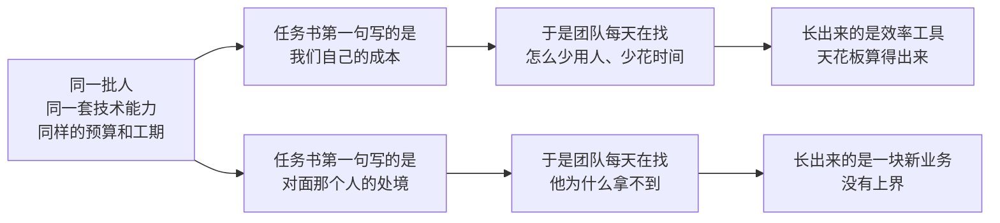

# 第 11 章 开疆拓土不是降本增效

> **第三部 · 终局一**　前面十章讲的是怎么把第一仗打赢。这一章讲打赢之后往哪儿走：把优化函数从内部成本换到客户侧。

| 这一章 | |
|---|---|
| **要你想清楚的** | 你现在优化的那个函数写的是什么，以及它还能不能换 |
| **核心判断** | 同一批技术能力，函数写成内部成本就长出效率工具，写成客户能不能拥有一辆车就长出一块新业务 |
| **代价也要看** | Kavak 那 50% 融资渗透率和估值跌 75%，是同一个故事的两半 |
| **企业内部的正确顺序** | 先用降本增效建立信用和预算，再换函数。倒过来做，第一仗就死 |

**找新市场的那一个动作**

去看你现有的系统正在拒绝谁。被拒绝的那批人，就是那个还没被写进函数里的市场。

## 一、他算了一下天花板

徐磊跟我说，他有点慌。

徐磊是浙江宁波的一家家电代工企业昱恒电器的内部 FDE（根据真实情况脱敏虚构）。昱恒有四千多名员工，主要给几家国际品牌做小家电代工。徐磊在这家公司干了七年，前四年在供应链，第五年转过来做 AI 落地，到那时候刚好打完三仗。

三仗的账加起来大概两百万，老板很满意，年底给了他一个新的编制。他慌的原因是他自己拿计算器算了一遍：把他熟悉的这条业务线上所有能省的环节全部省完，理论上限大概是八百万。他现在做完了四分之一。

然后呢。

他说这句话的时候不是在抱怨，他是真的在问一个业务问题。一个人如果把自己的价值定义成"我能省多少钱"，那么他的天花板等于公司现在这些成本的总和，而这个数字是固定的、可枚举的、而且会随着他的工作越来越小。他干得越好，剩给他的空间越少。

这是九站走完之后必然会撞上的一堵墙。

前十章我教的每一件事——挖真问题、定 Eval、造东西、推采纳、算账——都对着同一个方向，把一件已经在做的事做得更快、更准、更省。这个方向没有错，而且它必须先走，理由在这一章后半段。

但它有一个上界，而上界是可以被算出来的。降本增效的天花板，就是你现在这些成本的总和。

这一章讲怎么把这个天花板捅开。方法只有一句话，换一个优化函数。

## 二、优化函数是什么意思

给一个技术团队立项的时候，任务书的第一句话决定了这个团队接下来一年长成什么样。

这句话我要拆开说，因为"优化函数"这个词听起来像个数学概念，实际上它是一个非常具体的组织事实：你的团队每天在追的那个数字是什么。

*图注：分岔不发生在能力上，发生在立项那天写下的那个数字上。*

所以下次给技术团队立项，先看任务书第一句话写的是谁的目标。这句话听起来像口号，所以下面我要用一个有对照数字的案例把它坐实。

在那之前先看一个第 1 章出现过的对照，它是同一件事的轻量版。

空客给 Palantir 的题目不是"帮我们升级数据基础设施"，也不是"建一个数据中台"，是"把 A350 的月产量从 4 架爬到 8 架，再往 16 架走"。这两种写法背后是同一个项目、同一批数据、同一群工程师。

写成"月产 4 架到 8 架"，团队被迫先去搞清楚现在为什么只有 4 架，第 8 章那个 ontology 决定就是这么长出来的，后来变成了 Palantir 卖了十年的东西。

这还只是同一个方向上的换写法。函数仍然在空客自己这一侧，追的仍然是内部的产出效率，只是从"技术产出"换成了"业务产出"。它已经能带来这么大的差别。

接下来两节讲的两次实验，换的东西更彻底：它们换的是函数的归属方，从"我们的成本"换成"对面那个人的处境"。第一次是我自己在中国做的，我把话说在前面，那次尝试没有跑到终点，但正因为我一堵墙一堵墙撞过去，我说得出它每一处卡在哪。第二次发生在墨西哥，那一次跑完了一整轮，连代价都摆在明面上。

## 三、我试过换这个函数，用的是资本的方式

先交代我当时站在哪个位置上。

第 1 章讲过我做顾问的那笔账：讲课的十个项目十个都爽快付钱，真要动手落地，十个二十个里才转化成一个订单，转化了的三个里才有一个推进顺利。这笔账最难受的地方其实不在成功率，在收入的形状。

**咨询费是一次性的**。一个项目做完，钱结清，合同关闭，我回到零，重新去找下一个客户，从头再走一遍讲课、转化、推进这三道漏斗。而我在那个项目里真正留下来的东西——省下来的工时、跑通的流程、那家公司从此多出来的一份能力、以及最贵的那样，老师傅脑子里被掏出来变成资产的判断——全部沉在客户的资产负债表上，一分钱也回不到我这边。

我干得越好，这个落差越刺眼。我的收入是我卖出的人天，而我创造的价值是别人公司的估值。这是两个不同量级的数，而我拿的是小的那个。

所以我开始想另一种收钱的方式。

### 那个设计

这件事在美国有人在跑，叫 AI roll-up：不收服务费，改成用资本合作的方式并购或者占股，带团队进去用 AI 把这家传统企业的运营效率提上来，赚的是自己那部分股份的增值。

那才是大钱。

我到今天仍然认为这个设计在逻辑上是成立的，而且成立得很干净。它成立在两处。

第一处，它把我的优化函数从"这个项目能收多少钱"换成了"这家公司三年后值多少钱"。这两个函数指向的动作完全不一样。前者会让我倾向于把范围切小、把工期压短、把交付物做得漂亮好验收，因为验收之后才能开发票；后者会让我倾向于去动那些最难动、周期最长、但一旦动成了就再也回不去的东西——把一条业务的流程整个重排，把一批老师傅脑子里的判断挖出来变成公司资产，把两个吵了五年的部门的数据口径统一掉。这些活在服务合同下全是亏本买卖，在股权结构下是本分。

第二处，它把甲方那个"能不能按业务效果付费"的要求正面接住了。甲方要见了兔子再撒鹰，这个要求本身没有错，他们见过太多做完就走、留下一套没人会改的系统的乙方。而如果我持有股份，我就是那只兔子的一部分。双方的账在这一刻第一次对齐：他要的效果和我要的回报，是同一个数字的两种说法。

道理讲到这里，任何一个投资人都会点头。我当时也点头。然后我去做了，然后我撞上了五堵墙，一堵比一堵实。

### 第一堵：估值分歧，而且双方各自都对

第一件要谈的事是按什么价钱买。而这个价钱背后是一个绕不开的问题：AI 提效带来的那部分增值，算在谁头上。

我的账是这样算的：按你现在的样子定价，我进来把利润从三千万做到六千万，多出来的那三千万里有我的份。老板的账是另一样：你既然这么有把握能做到六千万，那你就按六千万来买，风险你担着。

这两个立场都不是不讲理，它们是同一个问题的两个正确答案。我要买的是"改造之前"的价格，他要卖的是"改造之后"的价格，而中间那一段是我唯一的利润来源。谈判在这里不是价格拉锯，是标的物本身没有定义清楚。

而且中国民营制造业老板心里那个估值锚，通常不是今天的经营数据，是行业最好那一年同行卖出去的那个价，或者是他自己当年扩产时投进去的固定资产。这个锚很难被一份现金流折现模型说动。

### 第二堵：控制权，而这一堵是死结

我遇到的绝大多数创始人，愿意谈的是让出一小部分股份，不是控制权。这一点完全可以理解，公司是他一手做起来的，那是他的人生。

但少数股东手里没有那支笔。

AI 落地的实质是什么，前十章已经写清楚了：改流程、改考核、改谁向谁汇报、改一张单子上谁签字。第 4 章那份授权书里最要紧的第四条写的是"业务流程可以改"，那一条只有拍板人能给。一个持有百分之十五股份的外部股东，在董事会上有一个座位，在车间里什么都没有。

反过来要控股呢？价钱和创始人的意愿两头都不成立，而且就算成立了，还有一个更麻烦的后果：创始人一走，公司里那批只认他的人也走。而这本书从头到尾在讲的那个东西——Context，藏在流程例外、老师傅判断和组织政治里的那份 Context——恰恰长在那批人身上。你买下了公司，赶走了 Context。

### 第三堵和第四堵：中国资本市场当下的具体状况

第三堵是财务规范度。尽调进去会遇到一件在中国不算稀奇的事：真实的经营情况和报表上的经营情况不是一回事。它的杀伤力很具体，**它让基准线不存在**。你要赚的是提效带来的增值，第一件事就是把提效之前那条线钉死；如果那条线本身是两个数、没有人能公开说哪一个是真的，三年之后利润涨了，你证明不了起点在哪儿。

第四堵是退出路径。一家营收几个亿的传统制造企业，退出通道很窄：上市要排队，卖给产业方同行也在过紧日子，老股转让打折可能把那部分增值吃掉大半。它的实质是时间不匹配——改造运营的回报周期以三到五年计，而基金的存续期、投资人的耐心、团队愿意跟着你等的时长，都比这个短。

### 第五堵：归因，这一堵最根本

前面四堵都是中国资本市场当下的具体状况，它们会随着时间变化。第五堵不会。

三年之后，这家公司的利润多了两千万。这两千万里有多少是我做的那套系统带来的？

诚实的回答是没有人知道。也可能是原材料价格降了，也可能是最大的竞争对手出了事，也可能是新来的销售总监把华东区打开了，也可能是汇率。反过来，如果利润掉了两千万，同样有一串同样成立的解释，而其中最方便的一条永远是"你们那套 AI 没做出效果"。

麻烦的地方在于，股权比例是在第一天签的，而归因是在第三年才发生的。一个在第一天就固定下来的分配方案，承载不了一个在第三年才知道答案的判断。

服务合同为什么反而做得到？因为它的算账对象小得多。第 10 章那套方法算的是"这一个场景，这一批单子，从 6 分钟降到 2 分钟，一年 1.4 万单"——它有分母，有基准线，有一个业务方愿意签字确认的口径，而且它主动扣掉那些说不清是谁的功劳的部分。这套方法之所以能成立，正是因为它把范围切到了小得可以归因的尺度。

一旦换成股权，要算的就不再是"这个场景省了多少工时"，而是"这家公司多值了多少钱"，而后者没有任何一种记账方法能拆到某一方头上。**换句话说，我为了拿到那份大钱，亲手放弃了唯一那把能证明自己有功劳的尺子**。

### 这五堵墙放到企业内部，还剩几堵

现在把这五堵墙搬到"企业内部"这个场景里，重新看一遍。

估值、控制权、退出路径这三堵，是"我在外面"这四个字的产物，进了内部直接消失——内部 FDE 不需要谈一个进入价格，不需要用钱去买那支笔（他需要的是第 4 章那份授权书，成本是老板的一次签字和一场当着所有人开的会），也不需要一个接盘方。财务规范度换掉了标准：他要的不是一个能过尽调的账本，是第 10 章那条基准线，一个场景一条，业务方当面点头就算数。归因是唯一没有消失的一堵，但他不需要说清——他拿到的不是"增值的百分之几"，是一个人在一家公司里的完整前途，而那本来就靠一连串可被引用的成果来分配。

五堵墙，进了企业内部剩下半堵。

### 这件事的结论

**换优化函数这件事，在乙方身份下极难做成，在企业内部反而容易**。

不是因为内部的人更聪明，也不是因为外部的人不够努力。是因为内部 FDE 从第一天起就分享这家公司的长期价值，而这份分享不需要任何一份合同去定义、不需要一次估值谈判去确认、不需要一个退出通道去兑现。乙方要花几千万、谈半年、担全部风险才能买到的那个位置——一个既能改流程、又能分享改造之后长期收益的位置——一个内部员工在入职那天就已经站在上面了，只是他自己往往不知道。

我试过那条路，所以我知道它卡在哪。这也是为什么这本书讲的是内部培养，而不是教你怎么找一家更好的乙方。不是乙方不行，是乙方那个位置上装不下这个函数。

## 四、墨西哥的停车场：跑完一整轮是什么样

我那次实验停在了半路上。海外有一个跑完了一整轮的样本，它的价值不在于证明机理——机理上一节已经推完了——而在于让你看见函数换到客户侧之后，那件事长满了是什么样子，以及它要付的账单是什么。

Kavak 是一家墨西哥的二手车公司，2016 年成立，五年做成拉美第一家估值超过十亿美元的创业公司。在它出现之前，这个市场没有标准也没有质保，而传统银行拒绝约 60% 的车贷申请。

Kavak 的做法是先定客户体验目标，再组建技术团队，团队才去开发买、卖、融资全流程的系统。注意这个顺序——它不是叙事细节，它就是优化函数本身。

技术团队被组建出来的那一刻，它的任务书上写的是客户的处境，不是公司的成本。

完整案例见 [胜 · Kavak 开疆拓土](../04-案例库/胜-Kavak-开疆拓土.md)。

### 第一步：把"这辆车能不能信"变成可计算的

每辆收进来的车走 240 项检查，检查流程之上跑机器学习，根据里程、品牌、使用情况预测每个零件需要更换的概率，检测流程因此加速 70% 以上。定价上，把公开的行业数据和自己的成交数据合起来算，给买卖双方一个公允且持续更新的价格。

请注意"检测流程加速 70%"这个数字的性质。单独拎出来放进一份汇报，它就是一个标准的降本增效成果，任何一个 IT 部门都能立这个项。但它在这里干的不是这件事：240 项检查加上零件概率预测，合起来是把"这辆车值不值得信"变成可计算的；可计算之后才能标准化，标准化之后才敢给质保，敢给质保之后，"带质保的标准二手车"这个品类在墨西哥第一次成立。

同一个技术动作，函数写成内部成本，终点是一份效率报告；函数写成客户的信任，终点是一个新品类。

### 第二步：那堵自己修不动的墙

车检干净了，价格公允了，质保也给了。客户站在展厅里点头，最后还是走了，因为贷不到款。

这个卡点不在 Kavak 的任何一个系统里，它在别人家的风控模型里，而那个模型看的是征信历史，这个国家大部分人根本没有征信历史。

摆在面前的有三条路：继续在自己这边优化、和银行合作做联合风控、自己做金融（三条路各自的代价见 [胜 · Kavak 开疆拓土](../04-案例库/胜-Kavak-开疆拓土.md)）。第一条最安全，每个指标都能算清 ROI，代价是成交的天花板被别人的拒贷率锁死——**这条路就是第一节徐磊的处境，只不过发生在一家公司的尺度上**。多数公司会选第二条，因为它看起来是中间态；我的判断是它其实是三条里最脆的一条，因为它把公司的天花板交给了一个和你利益不一致的第三方。

所以下次遇到"客户体验的卡点不在我们系统里"，别急着把它划到范围之外。卡点落在别人家的模型里，通常意味着两件事：你被别人的风险偏好定义了天花板，而那里可能就是你的下一块业务。

### 第三步：50% 对 10%

Kavak 做了 Kavak Capital，用数据算法评估还款能力，对没有传统银行记录的人开放。

> 超过 50% 的 Kavak 成交带自家融资，而地区传统行业的平均水平只有 10%。

这组数字干净在哪里：它有分母，分母是成交量；它有对照，对照是同一个地区传统行业的 10%；对照来自同一个市场、同一个时期、同一类交易。第 10 章讲过读效果数字的三条规则——要有分母、要有基准、绝对值优先于百分比——这组数字三条全过。

同一批技术能力，拿去做降本增效，产出会写成"审批自动化，人力成本降 40%"，这是一个真实的、值得做的成果。拿去对着客户的目标，产出是让原来买不了车的人买到了车，顺便让公司多了一块占成交一半的业务。这两个产出的工程难度是同一个量级的，甚至前者更麻烦，因为它要对接一堆遗留系统。

这里要补一句，否则这个案例会被读成一个纯技术故事：信任不是只靠软件兑现的。软件解决的是"可计算"，同时建起来的那批线下运营中心、质保和退货体系解决的是"可兑现"，两样缺一样，那 50% 都不会发生。换函数决定了这支团队往哪个方向搜索，重资产决定了这个方向上能走多远。

### 第四步：账单

2023 年之后，Kavak 的估值从峰值跌了 75%，关掉了哥伦比亚和秘鲁两个国家的业务。

这两半是同一个故事。

那 50% 的融资渗透率，翻译成财务语言是：Kavak 的资产负债表上挂着一大笔别人不肯挂的风险。银行拒掉那 60% 的申请不是因为银行蠢，是因为在银行的账本上那些贷款不划算。Kavak 把它们接了下来，同时也把坏账、催收、资金成本一起接了下来。

结构性冲突在这里：开疆拓土的优化函数追的是客户能不能拥有一辆车、一个新市场能不能被建立起来，回报周期以年计；而资本市场的评估周期以季度计。当外部融资环境收紧的时候，季度这一侧永远赢。

估值跌 75% 和 50% 的融资渗透率，是同一个决定的两组后果。你不能只要前面那一组。

## 五、两次实验放在一起

我那次和 Kavak 这一次，换的是同一个函数，结局不同，而不同的地方恰好是这一章要说的东西。

Kavak 是自己人在换，所以撞上那堵墙的时候，它可以选第三条路。

我那次是外人在换。我想赚的是客户提效之后的增值，而我不在那家公司里面。于是我遇到的每一堵墙，都长在"我在外面"这四个字上：要谈价格是因为我在外面，要谈控制权是因为我在外面，要查审计报告是因为我在外面，要找退出通道是因为我在外面，要做归因也是因为我在外面——只有分钱的人不是同一群人的时候，才需要精确归因。

所以这一章的核心判断可以写完整了：

> 把优化函数换到客户侧，是一件在乙方身份下极难做成、在企业内部反而容易的事。

难和容易的分界线不在能力上，在你和这家公司的长期价值之间隔着几道合同。乙方隔着三道：一份服务合同、一次估值谈判、一个退出通道。内部 FDE 一道都不隔——他分享这家公司的长期价值，是他作为员工这件事本身自带的，不需要任何一份文件去定义。

所以开疆拓土这件事，只有站在船上的人做得动。船票不是能力，是身份。

## 六、顺序：先降本增效，再换函数

所以在企业内部做这件事，正确的顺序是：

> 先用降本增效的项目建立信用和预算，再把优化函数换到客户侧。

这个顺序比单纯喊一句"要开疆拓土"有用得多，而且它和前面那套九站的结构是一致的。

第一仗必须选一个能算出钱的场景，这句话在第 5 章讲选题的时候出现过一次，当时给的理由是"省钱最容易被验证"。现在可以给出真正的理由：不是因为省钱最重要，是因为你需要那笔省下来的钱去买后面的耐心。

耐心这个东西在企业里是有价格的，而且价格不低。一个换到客户侧的项目，前六个月很可能拿不出任何一个能进财务报表的数字。这六个月里，会有人在会上问你这件事什么时候能算清账，会有别的部门盯着你这个编制，会有一个季度的预算复审。你能不能挺过这六个月，取决于你在此之前攒下了多少可以被引用的成果。

第 10 章讲的安克那一刀，在这里可以重新读一遍：它把团队切成背 ROI 的和不背 ROI 的两拨，用比例而不是用先后来处理同一个两难。

一个刚打完第一仗的内部 FDE 没有比例可切，只能在时间轴上做：前三仗背 ROI，第四仗开始试着换函数。

顺序倒过来的后果我见过。一个团队第一个项目就去做客户侧的新东西，做了五个月，方向是对的，但没有任何一个中间产出能被非技术的人理解。第六个月组织架构调整，这个团队被并进了别的部门，项目没有被宣布失败，它只是没有人再提起。

顺序不对不会让你做错事，它会让你没有机会把对的事做完。

### 什么信号出现的时候可以换

"先降本增效再换函数"这句话如果只说到这里，它会变成一个永远不会到期的推迟理由。所以要给它一个到期条件。

四个信号，出现三个就可以动了。

第一个信号是天花板被算出来了，而且不是你一个人算的。徐磊那个八百万是他自己拿计算器算的，这不够。够的标准是这个数字被写进了一次正式汇报，并且没有人反驳它。当你的老板也看见那条上界的时候，他会比你更早开始问"然后呢"。

第二个信号是你开始接到"顺手帮我看一下"的请求，而且请求来自你没做过项目的部门。这说明你的信用已经外溢出第一仗的边界。信用外溢是最可靠的一个信号，因为它是别人用行动投的票，不是你自己的感觉。

第三个信号是你手上出现了一份"我们不做的事"的清单，而且这份清单不是你去要来的，是你在做前几仗的时候顺手记下来的。下一节会讲这份清单怎么攒。如果你手上一条都没有，说明你前几仗做得太窄，还不到换函数的时候。

第四个信号是有人开始跟你抢预算，理由是"这件事我们部门也在做"。这在企业内部是一个被误读得很厉害的信号，多数人把它当成威胁。它其实是一个到期提示：你正在做的这件事已经变成常识了，常识不需要一个专门的人，而你现在还是一个专门的人。

反过来，有一个信号出现的时候绝对不能换：前三仗里有一仗的账还没结清，业务方还没在效果上签过字。带着一笔悬着的账去开新战场，第一次预算复审就会被翻旧账，而你没有任何东西可以拿来回答。

## 七、找新函数的方法：去看现有系统正在拒绝谁

现在给一套可操作的找法，它是这一章唯一的方法论。

银行拒了 60% 的车贷申请。那 60% 就是市场。

这句话可以推广成一个进场动作：

> 我们现在拒绝服务的是谁？为什么拒绝？如果用今天的数据和模型重算一遍，还需要拒绝吗？

三个问题按顺序问，第一个问题最难，因为大多数公司不知道自己在拒绝谁。

拒绝这件事在企业内部很少以"拒绝"的形式出现。它长成别的样子。

一张不接的单，理由是"这个客户太小，跑一趟不划算"。一类不做的服务，理由是"这种需求太个性化，没法标准化"。一个被降级处理的客户群，理由是"他们的问题走自助渠道就行"。一批进不了系统的申请，理由是"材料不全，让他补齐再来"。一个从来没被算过账的区域，理由是"那边量太小"。

这些理由在被提出的那一年全都是对的。它们的共同结构是：服务这批人的边际成本高于边际收益，所以理性的做法是不服务。

而这个不等式的两边，在过去三年里都发生了变化。边际成本那一侧塌了，因为原来要人做的判断现在有一部分可以自动做；边际收益那一侧的信息也变了，因为你现在能看到的关于这批客户的数据比当年多得多。

所以第三个问题——如果用今天的数据和模型重算一遍，还需要拒绝吗——是一个真问题，不是修辞。

### 五步，一步一步做

这三个问题不能当成三次头脑风暴来问。把它们变成五个具体动作，大约两周，其中两处最要紧。

一是**把拒绝拉成一张不少于三十行的表**。三十这个数不是随便定的：低于三十行，你拉出来的多半都是同一类原因的不同说法；到了三十行，重复的类型会自己浮出来。

二是**立项的时候必须留一个三个月内一定出数的中间指标**，最好用的那个是"被系统拒绝的那批申请里，重新评估之后可以通过的比例"。它每个月都在动，天然带着分母，一个完全不懂这件事的人也看得懂它在动。第八节还要用到它。

五步的完整做法——去哪儿拉那张表、怎么归类、怎么问"当年在防什么"、怎么算那笔小账——见 [拒绝清单法：找新优化函数](../02-方法论/拒绝清单法-找新优化函数.md)。

### 判断标准

不是所有的拒绝都该被推翻。这一节必须加上边界，否则它是危险的。

第一条判据，你手上有没有对方没有的数据。Kavak 敢做银行不敢做的事，不是因为他们更勇敢，是因为他们手里有交易数据和车况数据，而银行没有。一辆车值多少钱、这个客户在这个平台上的行为是什么样、车能不能被收回和再销售，这三件事 Kavak 全知道，银行一件都不知道。这是风险定价的信息优势，不是风险偏好的差别。

如果你手上没有任何一份别人没有的数据，那么你去做别人拒绝的生意，你就是在承接别人挑剩下的风险。这不是开疆拓土，是接盘。

第二条判据是给企业内部用的：这个被拒绝的群体，有没有一个人在公司里为他们说话。如果没有，你要做的第一件事不是建模型，是找到那个人或者成为那个人。一个没有人在内部代言的客户群，即使你算出账来了，也很难通过任何一次预算评审。

## 八、这一章的两条约束，以及代价由谁承担

这一整章的判断压在两条约束上。它们不依赖任何一家公司的特殊条件，任何一家公司都成立，所以它们值得单独摘出来写一遍。

**第一条：一个技术团队每天追的那个数字，决定了它在优化空间里往哪个方向搜索，跟这个团队的觉悟无关**。

**第二条：一个新角色能不能拿到六个月不出数字的空间，取决于他此前攒下了多少可以被引用的成果**。

这一条不需要举例。它的推论就是这一章那个顺序——先用降本增效攒信用和预算，再换函数，顺序不是保守，是这条约束的直接结果。

第二件要写清楚的事是代价，因为它由具体的人承担。

Kavak 估值跌 75%，这个代价由投资人和被裁掉的员工承担。我那次的代价由我自己承担，是几年时间和一笔在中国这个市场上买来的经验。而在企业内部，一个换函数的项目做砸了，代价由那个 FDE 一个人承担，具体形态是他的下一次晋升、他在这家公司的位置，以及他自己对这件事还剩多少信心。

所以上一节那个中间指标不是一个可选项，它是这个代价的对冲。有了它，你才有资格向公司要那六个月；没有它，你要的是信任，而信任在第七个月的预算会上不够用。

## 九、回到那个算天花板的人

徐磊后来做的事情，就是上一节那五步里的第一步。他把昱恒那条业务线上过去两年所有"因为不划算而没接的单"拉了一遍。

这个动作花了他三天，因为那些单子不在任何一个系统的正式表里，它们散在销售的备注、群聊记录和一份手工维护的 Excel 里。这本身就是一个发现：一家公司拒绝谁，通常没有留档，因为拒绝不需要走流程。

最后拉出来一百六十四单，报价合计约两千九百万，其中一百二十单的拒绝理由归到同一类：小批量、多规格、开模和排产成本摊不平，接了就是亏。这条规矩是 2019 年一次亏损之后定下来的，定它的人是当时的生产总监，那位总监两年前已经退休了。

比这三个数字更要紧的是他看完之后跟我说的那句话：他原来以为自己这两年在做一个效率项目，看完那张单子才意识到，他优化的那个函数是老板给的，而他从来没有问过一句为什么是这个。

这就是这一章想让你做的全部动作。不是马上去开一块新业务，是先去看一眼你现在追的那个数字是谁写的，以及如果换一个写法，会长出什么。

至于这一批人最后能长成什么，那是最后一章的事。

---

## 带走这一张

### 这一章的三个判断

**降本增效是入场券，不是终点**。它建立的是信用和预算，不是你的天花板。一个只会降本增效的内部 FDE，三年后会被当成一个更贵的 IT 支持。

**换函数比换技术难得多**。Kavak 用的技术能力和做效率工具的公司没有本质差别，差别在于他们把优化目标从「我们的成本」换成了「客户能不能拥有一辆车」。这不是技术判断，是商业判断，而且只有懂业务的人做得出来。

**代价要提前说清楚**。估值跌 75%、关掉两个国家、管理层重组，和那 50% 是同一个故事的两半。讲一半是鸡汤，讲全了才是可以决策的东西。

### 顺序

| 时机 | 干什么 | 为什么 |
|---|---|---|
| 第一仗 | 降本增效 | 建立信用和预算。没有信用，你提不出换函数这件事 |
| 第三仗起 | 留出不背 ROI 的空间 | 第 4 章那一节讲过。否则你培养的是项目经理不是 FDE |
| 第十仗 | 换函数 | 这时候你才有资格问「我们现在在优化什么」 |

### 接下来

最后一章把天花板抬到最高：FDE 是这个时代最好的创业预科。

---

*上一章：[第 10 章 算账、复制，和第二个人](第10章-算账复制和第二个人.md)*

*下一章：[第 12 章 创始人工厂](第12章-创始人工厂.md)——为什么 FDE 是这个时代最好的创业预科，培养出来的人会不会走，以及十年后这个词还在不在。*
