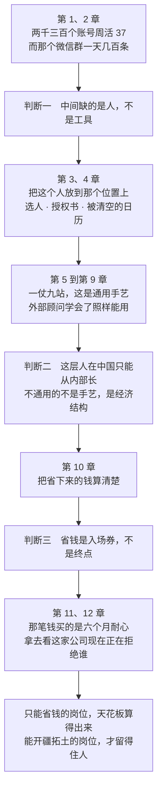

# 第 12 章 创始人工厂

> **第三部 · 终局二**　这一章是给这个岗位定天花板的。前面十一章讲的都是在一家公司里怎么干，这一章讲这份经历本身值多少钱。

| 这一章 | |
|---|---|
| **核心判断** | FDE 是这个时代最好的创业预科 |
| **证据** | 每一届 YC 里 ex-Palantir 创始人通常比 ex-Google 多，而后者员工数是前者的约 50 倍 |
| **机理** | FDE 的日常就是创始人的全部准备：进陌生组织、赢信任、找真问题、造解法、快速迭代 |
| **给负责人的** | 留不住他的不是合同。三层理由，第 7 到第 9 节 |

**这一章同时写给两个人**

FDE 读的是「我这几年在攒什么」。负责人读的是「他要走的时候，这家公司还剩什么」——这个问题的答案决定了你该不该培养第二个人。

## 一、他会不会走

去年，佛山一家陶瓷卫浴企业鼎信建材的董事长梁国栋听我讲完前面这一整套（根据真实情况脱敏虚构），沉默了大概十秒，然后问了一个问题：

"你说的这个人，我按你这套把他培养出来了。他会不会走？"

我当时的回答不好。我说了一堆"关键是让他有成长空间""要给他更大的舞台"之类的话，说到一半自己都觉得没意思，因为这些话回避了他真正在问的东西。他不是在问管理技巧，他是在问一笔投资的风险：我花两年时间、几个项目的试错成本、我本人的信用背书，把公司里一个懂业务的人变成一个稀缺人才，然后这个人的市场价格会翻倍，而我拿什么留住他。

这个问题的诚实答案是：他确实可能会走，而且概率不低。

这一章要把这件事讲透。它比前面十一章都难讲，因为这里有两个人在听，一个是掏钱培养的老板，一个是被培养的那个人，而他们的利益并不完全一致。所以那个"他会不会走"的答案要用四节来给，从第六节开始。在那之前，得先把另一件事说清楚：这批人到底能长到多高。因为如果他们长不高，老板那个问题根本不成立；正是因为他们能长得很高，那个问题才会痛。

## 二、为什么是这个岗位

先看两组数字。

一组数字来自 Nabeel Qureshi，就是第 8 章那位被派去图卢兹的前线部署工程师。他那一届入职的同批新人大约 25 个，其中出了 6 个独角兽级别的创始人。

另一组是他在《Reflections on Palantir》里写下的一个对比：

> 每一届 YC 里，ex-Palantir 创始人通常比 ex-Google 多，尽管 Google 的员工数量是 Palantir 的约 50 倍。

YC 是硅谷最主要的创业孵化器，每年分两届招人，每一届几百家公司。这句话说的是：在同一个筛选漏斗的出口处，一家小公司送出来的创始人，数量上压过了一家大它 50 倍的公司。

两组里更结实的是后一组，因为它的力量全部来自那个 50 倍的分母。人均创业密度差出这么大一个量级，不需要精确到小数点也能看清方向。

它们支撑的判断是这一条：这个岗位的创业密度显著高于同期同类的技术岗位，而且高出的幅度大到一眼就能看出来。

数字说明的是现象，接下来说机理。机理比数字更有说服力，因为它是你可以自己推一遍的。

Nabeel 入职的时候给自己算过一笔账，大意是：把"进入陌生组织、赢得信任、找到真问题、造出真解法、拿到快速反馈、迭代"这个循环，在不同行业里刷五遍，就是创始人的完整肌肉。

请把这句话和前面九站对一遍。

进入陌生组织，第 4 站。赢得信任，第 4 站里那个数据看门人，还有那句"这几张表的口径全公司还有谁懂"。找到真问题，第 4 站的 5 Whys 和三个差值信号。造出真解法，第 6 站。拿到快速反馈，第 7 站每天去找那个没登录的人看两分钟。迭代，全程。

这不是事后对齐。九站的结构本来就是从 Palantir 的驻场节拍、Basecamp 的 Shape Up、丰田的 A3 这几处长出来的，而 Palantir 那一部分之所以能长出九站，正是因为它本身就是这个循环的工程化版本——同一个循环，一个是写给创始人的，一个是写进了岗位说明书。

关键在循环的速度。

Palantir 的驻场节拍是：周一开会、周一晚上造、周二拿反馈、周二改、周三周四再来，一周跑四到五个完整循环。上午写的代码，下午就进客户迭代会——第 8 章把那位部署策略师的日程表逐条摊开过。

这个速度是这件事的全部要害。创始人的能力不是听课听出来的，是在"我以为客户想要 A，结果客户要的是 B"这个循环里刷出来的，而刷的次数决定了你多快能建立对真实世界的直觉。一年在大厂里可能刷 4 次，因为一个需求从提出到上线要三个月；同样一年在前线可能刷 200 次。

还有一样东西是这个岗位独有的，Nabeel 把它总结成一句：FDE 是政治嗅觉加写代码速度的罕见组合。

读房间、看懂权力结构、赢下多轮谈判，这三件事正好是融资、招人、销售的核心技能。而绝大多数技术岗位不训练这个，绝大多数商务岗位不训练写代码，只有这个岗位同时逼你练两样，而且逼你在同一件事上同时用两样。

训练这一端讲完了，但一个能量产创始人的地方，在选材那一端同样做过设计。第 3 章讲过那三条筛法——十分钟不相关的面试、给一群要去客户现场写代码的工程师发一本即兴戏剧教材、打一个会劝退大多数人的旗号。放在这一章的语境里再看一遍，这三件事和创业者画像的重合度高得不像巧合。

而准确的说法不是"这家公司在培养创始人"。它是在为一个岗位选人，而那个岗位的要求是让一个人独自进到陌生组织里、在没有正式权力的情况下把事办成。**它选的其实就是创始人，只不过给这批人发的是工资**。

这一条对一个中国公司的老板意味着什么，值得当面说清楚：你在第 3 章按那四条画像挑出来的那个人，他身上那些让你犹豫的特质——爱顶嘴、不太服管、对流程没耐心、总想跳过一层直接去问当事人——正是这套模式能起作用的前提。你把这些特质磨掉，你培养出来的是一个更好用的项目经理，不是一个 FDE。而如果你把它们留着，你就必须面对第一节那个问题。

他们不是在培养工程师，他们在选拔和训练一种能进任何一个陌生组织、活下来并且把事办成的人。而这正是创始人这个岗位的第一项要求。

## 三、从交付长出产品，这条路被验证过两次

FDE 通向创始人还有第二条路径，它不经过"离职创业"这个动作。

这条路径叫服务长成产品，而且它有两个可查证的样本，相隔十年。

第一个是 Palantir 自己。FDE 在前线反复遇到同类问题，留在总部的产品工程师把它们抽象成通用组件，Foundry 的早期组件就是这么长出来的。

这件事没有自动发生。Shyam Sankar 定过一条硬规定：每个客户部署必须在三个月内用上公司内部的工具。我想强调这条规定的性质，它是反人性的——对每一个具体的 FDE 来说，用自己手写的东西永远比用那个半成品内部工具更快、更可控、客户更满意。这条规定用组织强制压住了每个人的局部最优，换来了全局的产品化。

第二个样本是 Distyl AI，两个从 Palantir 出来的人把前线部署这个岗位本身变成了商业模式，同一条路径在 AI 时代重演了一遍，而且更快。他们的操作哲学有一句我认为该抄下来：不把 AI 叠在坏流程上，而是重建流程让 AI 来跑它。所以 FDE 团队会先花几个月重构客户的工作流，然后才部署 AI，顺序和大多数厂商相反。

这个顺序和第 4 站到第 6 站是同一个：先把流程搞清楚、改对，再让 AI 进去跑。

两个样本，相隔十年，同一条路径：先彻底解决一个客户的一个大问题，再把解法抽象成能卖给所有人的东西。两家的组件清单、毛利口径、融资数字，以及 Distyl 那三条还没解决的风险，见公司档案 [Palantir](../05-文库/公司/palantir.md) 和 [Distyl](../05-文库/公司/distyl.md)。

## 四、中国版的这条路通向哪里

上面讲的全是外部 FDE，他们的雇主是软件公司，他们的产品最终卖给市场。

前面九站教的是另一种，企业内 FDE，雇主就是他要改造的那家公司。第 1 章那张表列过两者的差别，最后一行写的是终局：原教旨 FDE 的终局是服务长成产品，企业内 FDE 的终局是从改内部流程走到开客户市场。

现在可以把这一行展开了。

一个中国企业内部的 FDE，他抽象出来的东西不会变成一个卖给外部市场的软件产品，至少第一步不会。它变成的是这家公司的组织能力：一套能生产下一个 FDE 的带教制度，一批可复用的模板和判断卡，一个知道数据在哪、口径是什么、谁能拍板的人。

第 10 章那三级复制讲的就是这件事。第二仗、第二个人、资产化。走完这三级，这家公司拥有的不是一个厉害的员工，是一条产线。

而这条产线的产出物，是第 11 章那个换函数的能力。

请把两章连起来看。第 11 章说找新市场的方法是去看现有系统正在拒绝谁，那一节的判断标准里有一条是"你手上有没有对方没有的数据"。一个中国制造企业、零售企业、物流企业，它手上有大量别人没有的数据，这一点它比任何一家 AI 公司都强。它缺的从来不是数据，是能把数据变成新业务的人，而且是一批而不是一个。

所以中国版的创始人工厂，产出的不一定是离职去创业的人，也可能是在公司内部开出一块新业务的人。后者在中国企业里有一个现成的词，叫内部创业，而它过去失败得很多，很大一部分原因是被派去内部创业的人不具备前十章那套手艺——他有资源、有授权、有老板的支持，但他不会进现场、不会挖真问题、不会定 Eval、不会推采纳。

手艺是同一套。经济结构不同，终局不同，手艺是同一套。

## 五、如果你是那个被选中的人

前面五节是讲给老板听的。这一节讲给另一个人。

如果你就是那个正坐在公司办公室里某一个工位上的下一个 FDE，第一仗打完之后，有三件事值得你自己想清楚，而且这三件事没有人会主动提醒你。

第一件，这个岗位在市场上正在被定价，而定价的速度比大多数人以为的快。

第 1 章那组供给侧数字已经把它摆出来了：岗位数、薪资中位数、还有谁在扩这样的团队，一年之内都换了一个量级。

我提这组数字不是劝你去跳槽，是提醒你一件相反的事：正因为这个岗位在被定价，所以你会在两年之内遇到第一次报价，而那次报价发生的时候，你最好已经想清楚自己在积累什么。

第二件，你的资产是病历，不是简历。

一份简历上写"负责公司 AI 项目落地，提升效率 60%"，和三十份写着并发症的交付病历，在市场上是两种完全不同的东西。前者所有人都会写，后者没有几个人有。第 10 章说三十份病历之后病历本身就是你的定价权，那句话是对着这一节说的。

而这些病历的绝大部分内容会脱敏，脱敏之后它们仍然成立——因为你的资产不是某家公司的数据，是"我在三家见过这个死因"这种判断力。

第三件，也是最容易被忽略的一件：你在这家公司积累的 Context 是有折旧的，而且折旧速度取决于你怎么用它。

如果你只是把它用来解决这家公司的问题，它在你离开的那一天归零。如果你在解决问题的同时，把每一次的"表面问题和真实问题之间的差值"记下来，那么你带走的是一套跨行业成立的诊断能力，它不折旧。

第 6 章那张判断卡的最后一列，"什么情况下这个判断是错的"，是给老师傅设计的。这一节我想说的是，你也该给自己填一张。

## 六、先说最诚实的那半句

现在回答第一节那个问题。

他会不会走。

**会**　有一部分会走，而且很可能是最好的那几个。这是这个问题唯一诚实的开头，任何绕开它的回答都会在两年之后被现实打脸。

安克创新的公开报道里，2025 年内有两位业务负责人先后离职，其中一位带走了近 30 人的团队去创业。而安克正是前面十一章里被当作正面样本用得最多的那家公司——它的创业小组制、它那一刀三分之一背 ROI 的切法、它那条三年连续的 AI 代码采纳率曲线，都被反复引用过。同一家公司，同一套机制，培养出来的人也会走，而且走的时候会带走团队。

这两件事不矛盾，它们是同一件事的两面。一家公司如果能把人培养到市场上有人来抢，那市场上就一定会有人来抢。有人来抢，恰恰是这套机制有效的证明，不是它的漏洞。一套没有人来挖角的培养体系，通常说明它没培养出什么。

但这个开头之后还有三层，缺一层都不完整。这三层不是三个备选方案，是要同时做的三件事：第一层是怎么降低他走的概率，第二层是这笔投资该不该做，第三层是怎么降低他走了之后的代价。

## 七、第一层：留住他的不是合同，是下一个函数

先说这一层，因为它最直接承接第 11 章，而且它是三层里唯一一层能真正改变结果的。

一个人打完三仗、把降本增效的天花板算出来之后，如果你能给他的下一件事还是省钱，他会走，因为他看得见那个上界，而且他知道自己越干那个上界越近。如果你能给他的是"去看看我们现在拒绝服务的是谁"，他大概率会留下来，因为这件事没有上界。

更要紧的是第二半句：**这件事只能在你这家公司里做**。他积累的全部 Context——哪条规矩是哪一年因为哪一单亏损定下来的、哪个数据字段的口径谁说了算、哪个部门的谁点头这件事才推得动——换一家公司要从零开始，而重建这些东西要花他两年。第 1 章那句"内部人的知识获取成本已经付过了"，讲的是公司省了钱；反过来对他本人同样成立：他离开这家公司，损失的正是这份已经付过的成本。

这不是感情牌，是一笔他自己会算的账。

一个老板在这件事上最容易做的动作是加钱，以及在加钱的时候补一份竞业协议。加钱解决的是价格问题，但他要走通常不是因为价格，是因为他看不见下一个题目。你用加钱回答一个关于题目的问题，他会收下这笔钱，然后在六个月后的某一天照样递辞呈，而那时候你连原因都不知道。竞业协议更糟，它传达的信息是"我知道你可能会走，所以我先把门锁上"——这个信息本身就在告诉他，这家公司给不出下一个函数，只能给一把锁。

### 三种给法

给下一个函数，有三种具体给法，从轻到重。

第一种，给一个没有上界的题目。第 11 章第七节那五步，第一步就是把公司"不做的事"拉成一张表。把这件事交给他，本身就是一次函数切换，而且成本只有三天。

第二种，给一个他说了算的范围。不是给一个更大的项目，是给一块地方——某个业务线的 AI 落地由他定优先级，预算他排，选题他挑，你只在两个地方拍板：动别的部门的流程，以及要钱。这比升职有效，因为升职给的是层级，这个给的是自由度，而对这类人来说自由度才是稀缺的。

第三种，给他一个人。第 10 章第二级那个"第二个人"，从一个交付动作变成一个身份——他从一个人打仗变成一个人带人打仗。这一步对很多人是决定性的，因为它把"我是这家公司的一个员工"变成了"这件事在这家公司里是我起的头"。

这三种给法不能保证他一定留下来。它们能做到的是把"他走"的原因从"这里没什么可做了"变成"外面那个机会实在太好了"。这个区别对老板很实在：前者你什么都做不了，因为等你发现的时候他已经想清楚了；后者你至少还在牌桌上，可以谈，而且他走的时候不带怨气。

## 八、第二层：不培养他，他也会走

第一层讲的是怎么降低概率。但一个老板真正要做的决策发生在更前面：这笔投资到底该不该做。

一个对业务有切肤之痛、敢顶嘴、能忍受模糊、动过手做过小工具的人，这是第 3 章那份画像的四条。这样的人在任何一家公司里都不会安静地待到退休。你不给他这件事做，他会去别处找一件事做，区别只是那件事发生在你公司里还是别人公司里。

所以真正的选择不是"培养他"和"留住他"之间的选择，是这两个之间的选择：他在这两年里为你做成了三件事，还是他在这两年里开了六百个会。

这一层还有一个更冷的算法。假设最坏的情况，他两年后确实走了。你这两年付出的是他的工资、三个项目的试错成本、以及你本人的一次信用背书；你拿到的是三笔已经落进报表的账、一批被改过的流程、以及第十节那份清单上的东西。而如果你什么都不做，这两年你付出的是同样的工资，拿到的是零。

一笔投资该不该做，不能只算它失败的概率，还要算不做它的代价。而在这件事上，不做的代价是一个确定值。

## 九、第三层：他走了之后，这家公司还剩什么

这是三层里最实际的一层，也是唯一一层完全由老板控制、不依赖那个人的意愿的。

它的做法只有一句话：把他走之后还能留下的东西，从第一天就攒起来，而不是等到他递辞呈那天才开始交接。

第 10 章那份交付病历，五栏，第 4 栏并发症不许空着，48 小时内写完，那一章说它是"给自己攒的，不是给老板看的"。这句话在教学上是对的，因为定位不改他写不出真话。但它在组织层面还有另一半：三十份病历留在公司里，是这家公司关于自己业务的一份别处买不到的档案。

带教制度也一样。第 10 章第二级说的是让第二个人打他自己的第一仗，第一个 FDE 每周五 30 分钟只提问不给答案。这套东西如果只在他脑子里，他一走就没了；如果它变成一套被写下来、被用过两轮、有人接手过的制度，他走了它还在。

### 清单：五样东西

前面十一章里，这些东西是散着出现的，每一样都各有各的用途。这里第一次把它们集中放在一起，因为它们合起来才是一个老板花这笔钱真正买到的东西。

| 剩下什么 | 从哪一站开始攒 | 攒成的标志 | 不攒的后果 |
|---|---|---|---|
| 三十份交付病历，每份第 4 栏并发症不空 | 第一仗第一站，48 小时内写完 | 新人翻病历能自己避开三个坑 | 每一个新人从零踩同一批坑 |
| 一套被用过两轮的带教制度，和跟着它出来的那个人 | 第 10 章第二级，第二个人上手那天 | 第三个人不需要第一个 FDE 带，第二个人能独立通过第 4 站验收 | 能力只在一个人身上，数据地图随他一起离职 |
| 一份业务方署名的价值口径文档 | 第 10 章算账那一站 | 换一任财务也认这套算法 | 他一走，所有成果重新变成"说不清" |
| 至少一张进了某人考核表的指标 | 第 9 章上线之后 | 没有人推它，它自己每月被看 | 系统在他走后三个月内静音 |
| 一批被公司口径改写过的模板 | 从第一次用附录 B 的模板开始 | 模板里的例子全是本公司的事 | 下一个人重新从通用模板起步 |

这张表值得挂在墙上，因为它同时是一份验收清单和一份风险清单。左边一列是资产，右边一列是这份资产不存在时会发生的事，而右边那些事都不会在他离职那一周发生，它们会在三个月后陆续发生，那时候没有人会把它们和这件事联系起来。

### 对梁国栋的完整回答

他可能会走。你能做的不是防他走，是三件事同时做：给他下一个函数，接受这笔投资本身的逻辑，以及把那五样东西从第一天攒起来——做完这三件，"他走了之后这家公司还剩什么"这个答案就从"什么都不剩"变成"剩一条产线、三十份病历和一个第二个人"。

这个回答不该让他完全放心，因为这件事本来就有风险。能确定的只有一条：另一条路——不培养任何人，等着市场上出现一个既懂你们业务又懂 AI 的候选人——风险更大，而且它的失败方式更安静。

## 十、十二章其实只说了三件事

走到这里，十二章的判断可以收成一条线了。

*图注：三个判断不是三条并列的主张，是一条链上的三个扣。第一个解释了为什么必须动手，第二个解释了为什么只能自己动手，第三个解释了动完手之后这个人凭什么还留在这儿——抽掉中间任何一个，前后两头就接不上。*

第一件事的证据在第 1 章：同一套模型、同一批底子，改完之后周活能到 1400 多，说明工具从来不是瓶颈。

第二件事的理由不在能力上，在经济结构上，第 11 章第三节那笔账已经逐条算过：只要人在外面，那几道题就都无解；而同样这几道题，对一个已经在公司里的人几乎全部不存在。

三件事连起来是一句话：**一家中国公司要在 AI 上真的动起来，得先在自己内部长出一个人；这个人先用省钱证明自己，再用开疆拓土证明这件事值得一直做下去**。

九站是这个过程的操作手册，十二章是它的完整推理。

## 十一、十年后这个词可能就不在了

最后说一件我经常想的事。

二十世纪初工厂电气化的那几十年，企业里出现过一批专门负责这件事的人。他们要懂电，也要懂车间，要说服老师傅把用了三十年的传动轴换掉，要重新设计整条产线的布局——因为电动机最大的价值不是替换蒸汽机，是让每台机器可以各自驱动，而这件事需要把整个车间推倒重排。这批人在当时是稀缺的、贵的、被专门讨论的。

今天没有人自称电气化专员。不是因为这件事不重要了，是因为它做完了，然后它变成了每一个工程师的基本素养，变成了建筑图纸上默认存在的一层，变成了没有人再需要单独讨论的东西。

FDE 这个词大概率会走同一条路。

十年之后，"进到业务里去把流程改掉"这件事可能不再需要一个专门的头衔，因为每一个业务骨干都会一点，每一个技术骨干也懂一点业务，中间那道缝合上了。到那时候，前面这九站、那些模板、那些进场话术，会变成一种大家默认就会的东西，就像今天没有人会专门写一本书教工程师"怎么给车间接电"。

那样很好。一个器官长成了，名字就不重要了。

所以这九站不是一个岗位的说明书，是一个过渡期的操作手册。过渡期有明确的开始和结束，而我们现在的位置是在开始之后不久——中国企业里跑完整轮的公开样本还很少，安克几乎是唯一一个完整的。这意味着现在进场的人，做的每一件事都还没有被别人做成模板，他自己就是那个模板。

第 1 章那句话到这里依然算数：判断我出，对错算我的。

留最后一个问题。

如果十年后确实没有人再叫 FDE 了，那么在你这家公司里，那件事最后是被谁做完的？

是你花两年培养出来的那个人，还是没有人——事情就那么一直搁着，直到有一天你发现同行已经绕过去了。

这个问题的答案不在这本书里。它得由你在接下来两年里，用一个具体的人名和一个具体的场景写出来。

---

## 带走这一张

### 给 FDE 的一句话

**你在攒的不是项目经验，是进入陌生组织并赢得信任的能力**。这件事在任何一家公司里都稀缺，而且没有学校教。

---

*上一章：[第 11 章 开疆拓土不是降本增效](第11章-开疆拓土不是降本增效.md)*

*正文十二章到此完稿。四篇附录：[附录 A 九站全表](附录A-九站全表.md)、[附录 B 模板索引](附录B-模板索引.md)、[附录 C 阅读地图](附录C-阅读地图.md)、[附录 D 来源与出处](附录D-来源与出处.md)。全书结构见[大纲](大纲.md)，仓库总览见[README](../README.md)。*
